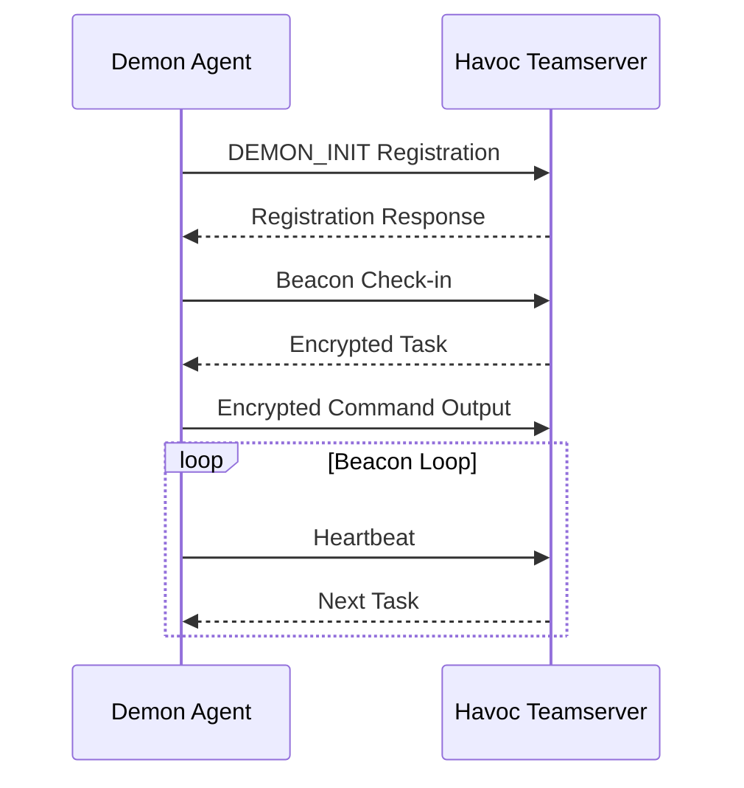
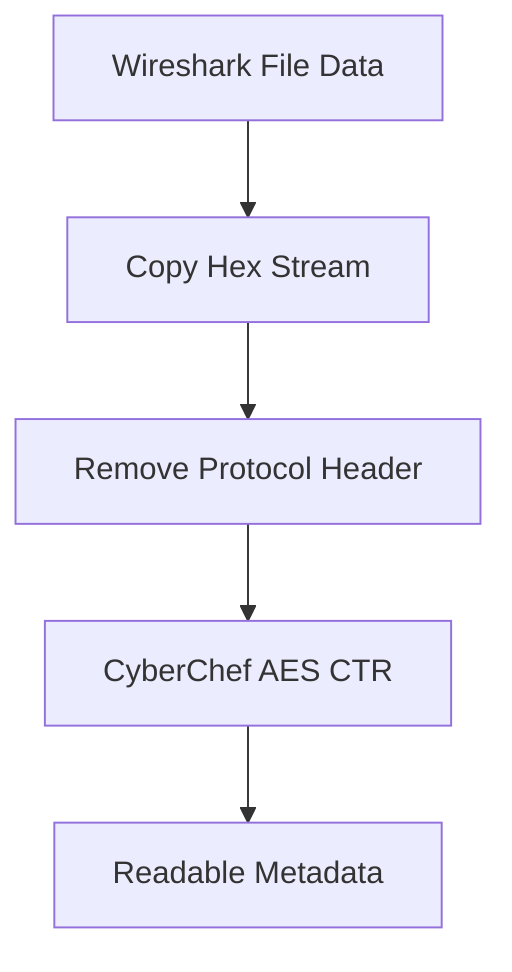
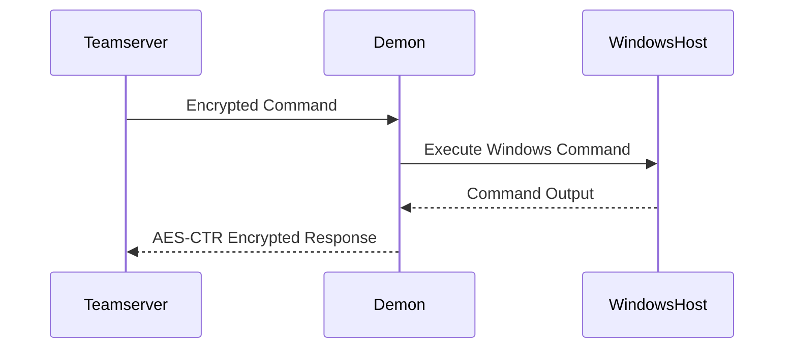
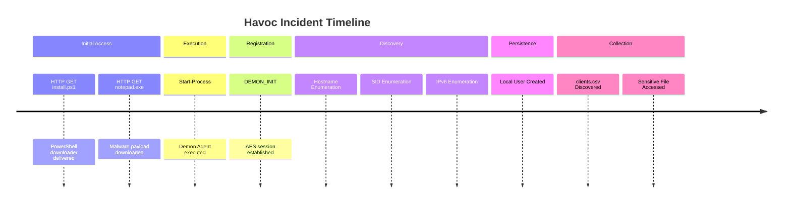
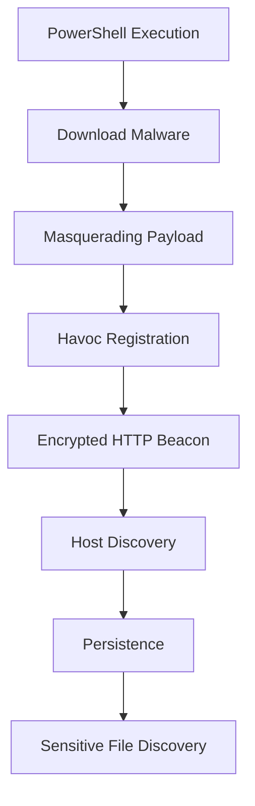
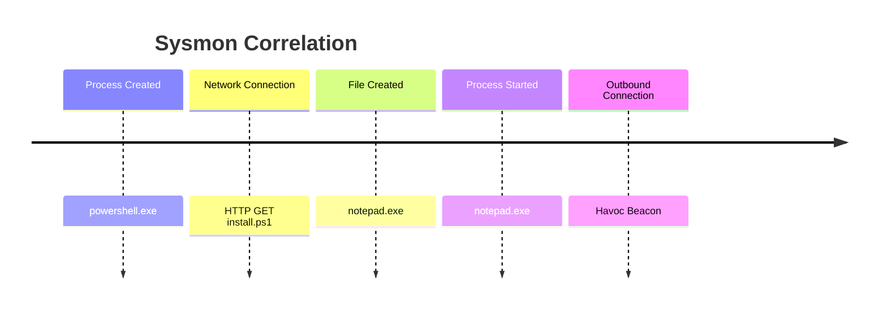
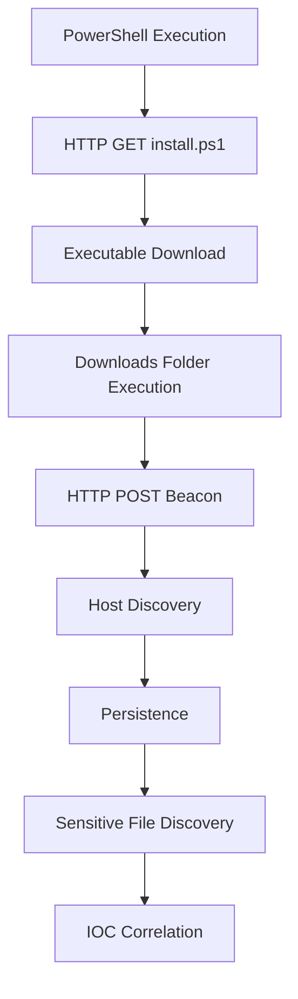
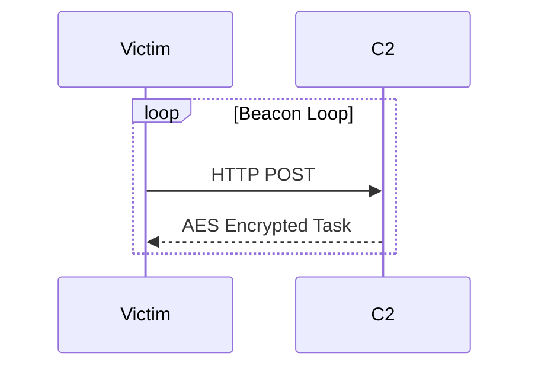
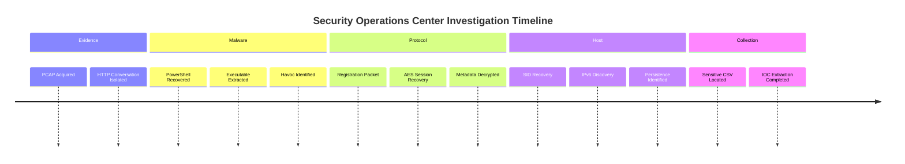

<link rel="stylesheet" href="{{ '/assets/css/custom.css' | relative_url }}">

<div class="hero">

<p align="center">

</p>

<div align="center">

# 🌪️ MAYHEM

## Blue Team Incident Investigation • Network Forensics • Havoc C2 Analysis

*A portfolio-grade Digital Forensics & Incident Response case study documenting the complete investigation of a Havoc Command & Control compromise from packet capture to attacker activity reconstruction.*

<br>


</div>

---

<div class="terminal">

### analyst@mayhem:~$ incident-summary

```bash
Case ID        : THM-MAYHEM-DFIR-001
Threat Type    : Havoc Command & Control
Investigation  : Network Forensics
Evidence Source: traffic.pcapng
Status         : COMPLETE
Confidence     : HIGH
Analyst        : Anurag R
```

</div>

</div>

---

# 👨‍💻 About This Investigation

> **Mayhem** is a Blue Team focused **TryHackMe** room that simulates a real-world malware incident investigation where the analyst receives a network packet capture instead of an exploitable machine.

Unlike traditional Capture The Flag rooms, this investigation requires reconstructing the complete attack lifecycle through **Wireshark**, **PowerShell analysis**, **HTTP object extraction**, **Havoc C2 protocol analysis**, **AES-CTR traffic decryption**, and **Windows artifact recovery**.

This documentation has been rewritten as a **professional DFIR case study** suitable for:

- SOC Analyst portfolios.
- Threat Hunting portfolios.
- Digital Forensics portfolios.
- Cybersecurity recruiter review.
- GitHub Pages showcase.

---

<div class="note">

## 🎯 Portfolio Objective

This project demonstrates the investigative workflow of a Security Operations Center analyst rather than simply solving a CTF.

**Focus Areas**

- Evidence Collection
- Network Forensics
- Malware Analysis
- Command & Control Investigation
- Cryptographic Traffic Analysis
- Threat Hunting
- Detection Engineering
- MITRE ATT&CK Mapping

</div>

---

# ⚡ Investigation Dashboard

<div class="grid cards" markdown>

- :material-radar: **Threat Classification**

  **Malware Family**

  Havoc Demon Agent

  **Attack Category**

  Post-Exploitation Framework

- :material-network-outline: **Evidence Source**

  Packet Capture (`traffic.pcapng`)

  HTTP Objects

  PowerShell Script

- :material-shield-search: **Primary Discipline**

  Digital Forensics

  Network Security Monitoring

  Incident Response

- :material-lock-check: **Encryption**

  AES-CTR

  Session Key Recovery

  Protocol Reverse Engineering

</div>

---

# 📚 Table of Contents

<div class="toc">

| Investigation Phase | Description |
|---------------------|-------------|
| Executive Overview | Incident summary & scope |
| Environment Overview | Victim, attacker infrastructure |
| Evidence Collection | PCAP acquisition & methodology |
| Network Investigation | Wireshark packet analysis |
| PowerShell Analysis | Malware staging investigation |
| Malware Extraction | HTTP Object Recovery |
| Static Malware Triage | Strings + Threat Intelligence |
| Havoc Protocol Analysis | C2 reverse engineering |
| AES Cryptographic Analysis | Session recovery |
| CyberChef Workflow | Traffic decryption |
| Windows Artifact Recovery | SID, IPv6, persistence |
| IOC Dashboard | Host & network indicators |
| MITRE ATT&CK Mapping | Tactics & techniques |
| Detection Engineering | Sigma, Sysmon, Splunk |
| Threat Hunting Playbook | Blue Team methodology |
| Lessons Learned | Defensive insights |
| References | Research resources |

</div>

---

# 🧭 Investigation Timeline

```text
                          INCIDENT TIMELINE

 Packet Capture Acquired
           │
           ▼
 HTTP Stream Reconstruction
           │
           ▼
 PowerShell Downloader Recovered
           │
           ▼
 Malware Extracted from HTTP Objects
           │
           ▼
 Havoc Demon Identified
           │
           ▼
 DEMON_INIT Registration Packet
           │
           ▼
 AES Session Key Recovery
           │
           ▼
 Encrypted HTTP Traffic Decrypted
           │
           ▼
 Windows Reconnaissance
           │
           ▼
 Persistence Established
           │
           ▼
 Sensitive File Discovery
           │
           ▼
 DFIR Investigation Completed
```

---

# 🌐 Attack Infrastructure Overview

<div align="center">

## Enterprise Network Reconstruction

</div>

```text
                   INTERNAL ENTERPRISE NETWORK

                 ┌────────────────────────────┐
                 │      Windows Workstation    │
                 │        10.0.2.38            │
                 │   (Compromised Endpoint)    │
                 └──────────────┬──────────────┘
                                │
                                │ HTTP GET install.ps1
                                │ HTTP GET notepad.exe
                                ▼
                 ┌────────────────────────────┐
                 │     HTTP Server / C2        │
                 │        10.0.2.37            │
                 │  Havoc Teamserver Listener  │
                 └──────────────┬──────────────┘
                                │
                                │ AES-CTR Encrypted POST Requests
                                │ Encrypted Task Responses
                                ▼
                    Havoc Demon Command & Control
```

---

<div class="warning">

## ⚠️ Public Disclosure Policy

This repository intentionally **does not publish**:

- Challenge Flags
- User Credentials
- Passwords
- Windows SID Values
- IPv6 Values
- Final Challenge Answers
- AES Session Keys
- Initialization Vectors

Every sensitive artifact is replaced with:

```text
[REDACTED]
```

This preserves the educational value of the room while preventing plagiarism.

</div>

---

# 🧪 Investigation Methodology

## Digital Forensics Workflow

This investigation follows a structured **DFIR lifecycle** instead of a traditional CTF workflow.

```text
                DIGITAL FORENSICS INVESTIGATION MODEL

 Evidence Collection
          │
          ▼
 Evidence Preservation
          │
          ▼
 Examination
          │
          ▼
 Analysis
          │
          ▼
 Correlation
          │
          ▼
 Reporting
          │
          ▼
 Detection Engineering
```

---

## Phase Breakdown

<table>
<tr>
<th width="180">Phase</th>
<th>Description</th>
</tr>

<tr>
<td><strong>Phase 01</strong></td>
<td>Packet Capture Triage</td>
</tr>

<tr>
<td><strong>Phase 02</strong></td>
<td>HTTP Stream Reconstruction</td>
</tr>

<tr>
<td><strong>Phase 03</strong></td>
<td>PowerShell Malware Investigation</td>
</tr>

<tr>
<td><strong>Phase 04</strong></td>
<td>HTTP Object Extraction</td>
</tr>

<tr>
<td><strong>Phase 05</strong></td>
<td>Malware Attribution</td>
</tr>

<tr>
<td><strong>Phase 06</strong></td>
<td>Havoc Protocol Reverse Engineering</td>
</tr>

<tr>
<td><strong>Phase 07</strong></td>
<td>AES Session Recovery</td>
</tr>

<tr>
<td><strong>Phase 08</strong></td>
<td>Traffic Decryption</td>
</tr>

<tr>
<td><strong>Phase 09</strong></td>
<td>Artifact Recovery</td>
</tr>

<tr>
<td><strong>Phase 10</strong></td>
<td>Detection Engineering</td>
</tr>

</table>

---

# 🛠️ Investigation Toolkit

<div class="grid cards" markdown>

- ### 🌐 Wireshark

  Primary packet capture investigation.

  HTTP stream reconstruction.

  TCP conversation analysis.

- ### 🔬 CyberChef

  AES CTR decryption.

  Hex stream decoding.

  Binary transformations.

- ### 🦠 Strings

  Static malware triage.

  Embedded artifact discovery.

- ### 🛡️ VirusTotal

  Threat intelligence correlation.

  Malware family attribution.

- ### ⚙️ PowerShell

  Downloader behavior analysis.

  Living-off-the-land investigation.

</div>

---

# 🎓 Skills Demonstrated

| Security Domain | Demonstrated Skills |
|-----------------|--------------------|
| Network Forensics | TCP, HTTP, PCAP Analysis |
| Malware Analysis | Strings, Threat Intel |
| DFIR | Timeline Reconstruction |
| Threat Hunting | IOC Correlation |
| Cryptography | AES CTR Investigation |
| Detection Engineering | Sigma, Sysmon, Splunk Concepts |
| Blue Team | MITRE ATT&CK Mapping |

---

# 📦 Repository Structure

```text
Mayhem--TryHackMe-Walkthrough
│
├── README.md
├── SECURITY.md
├── CONTRIBUTING.md
│
├── Documentation/
│   ├── Documentation.md
│   └── Documentation.docx
│
├── Resources/
│   └── notes.md
│
├── Screenshots/
│   ├── 01_room_banner.png
│   ├── 02_pcap_overview.png
│   ├── 03_http_install_ps1.png
│   ├── 04_http_object_export.png
│   ├── 05_strings_analysis.png
│   ├── 06_virustotal_analysis.png
│   ├── 07_havoc_init_packet.png
│   ├── 08_aes_key_iv.png
│   ├── 09_cyberchef_decryption.png
│   ├── 10_decrypted_metadata.png
│   ├── 11_sid_artifact.png
│   ├── 12_ipv6_artifact.png
│   ├── 13_persistence_artifact.png
│   ├── 14_flag_artifact.png
│   ├── 15_clients_csv_artifact.png
│   └── 16_answer_validation.png
│
└── docs/
    ├── index.md
    └── assets/
        ├── css/custom.scss
        └── images/
```

---

# 🚨 Executive Threat Briefing

<div class="security">

## Threat Summary

**Initial Access**

PowerShell downloader delivered over HTTP.

**Malware Payload**

`notepad.exe` masquerading executable.

**Framework**

Havoc Command & Control.

**Persistence**

Windows account creation.

**Discovery**

SID enumeration, IPv6 discovery, sensitive file discovery.

**Encryption**

AES CTR encrypted beacon traffic.

</div>

---

# 🧩 Blue Team Investigation Goals

- Identify malicious communication.
- Recover malware delivery chain.
- Attribute malware family.
- Reverse engineer Havoc protocol.
- Recover encrypted Windows artifacts.
- Build an enterprise-ready incident report.
- Produce detection opportunities.

---

# 📸 Evidence Collection

## Primary Evidence

> `traffic.pcapng`

The investigation is performed **without executing malware**.

All findings originate from:

- Packet Capture
- HTTP Streams
- HTTP Objects
- Malware Strings
- Threat Intelligence
- Cryptographic Reconstruction

---

---

<div align="center">

# 🔎 Phase 01 — Network Forensics Investigation

### *Packet Capture Analysis • Threat Timeline Reconstruction • Wireshark Investigation*

</div>

> *“The packet capture is the single source of truth. Every conclusion in this investigation originates from observable network evidence.”*

---

## 📌 Investigation Objective

Before identifying malware or decrypting traffic, the investigation establishes a timeline using **network telemetry only**.

### Questions Answered

<table>
<tr>
<th width="280">Investigation Question</th>
<th>Evidence Source</th>
</tr>

<tr>
<td>Which endpoint is compromised?</td>
<td>TCP Conversations + HTTP Requests</td>
</tr>

<tr>
<td>Who delivered the payload?</td>
<td>HTTP Stream</td>
</tr>

<tr>
<td>How was malware transferred?</td>
<td>HTTP Object Export</td>
</tr>

<tr>
<td>Where does malicious activity begin?</td>
<td>PowerShell Download Request</td>
</tr>

<tr>
<td>Which packets represent attacker activity?</td>
<td>Wireshark Timeline Correlation</td>
</tr>

</table>

---

# 🌐 Network Topology Reconstruction

<div class="grid cards" markdown>

- ## 🖥️ Victim Workstation

  **Host:** `10.0.2.38`

  Windows Endpoint

  Downloads & Executes Payload

- ## ☠️ Suspicious Infrastructure

  **Host:** `10.0.2.37`

  Python HTTP Server

  Havoc Teamserver Listener

- ## 🔄 Communication Protocol

  HTTP GET Requests

  HTTP POST Beacon Traffic

  AES Encrypted Responses

</div>

---

## 🛰️ Reconstructed Enterprise Network

```text
                      ENTERPRISE INCIDENT OVERVIEW

             ┌────────────────────────────────────────┐
             │       Windows Workstation              │
             │             10.0.2.38                  │
             │                                        │
             │  PowerShell Downloads Malware          │
             │  Executes Havoc Demon                 │
             └─────────────────┬──────────────────────┘
                               │
                     HTTP GET install.ps1
                               │
                     HTTP GET notepad.exe
                               ▼
             ┌────────────────────────────────────────┐
             │      HTTP Server / Teamserver          │
             │             10.0.2.37                  │
             │                                        │
             │ Python SimpleHTTP Server               │
             │ Havoc C2 Listener                      │
             └─────────────────┬──────────────────────┘
                               │
                 Encrypted HTTP POST Requests
                               │
                 AES CTR Encrypted Task Responses
                               ▼
                   Havoc Command & Control Session
```

---

# 📸 Evidence 01 — Packet Capture Overview


<div class="note">

### Figure 02 — Initial Wireshark Packet Capture

The investigation begins with the supplied packet capture opened inside **Wireshark**. Multiple TCP conversations exist, but only one conversation evolves into malware delivery and encrypted command-and-control communication.

</div>

---

## 🧠 Analyst Observations

Immediately visible indicators include:

<table>
<tr>
<th width="260">Observation</th>
<th>Forensic Interpretation</th>
</tr>

<tr>
<td>TCP FIN Packets</td>
<td>Normal connection termination unrelated to attacker activity.</td>
</tr>

<tr>
<td>New TCP Handshake</td>
<td>Beginning of suspicious communication.</td>
</tr>

<tr>
<td>HTTP Requests</td>
<td>Potential payload delivery mechanism.</td>
</tr>

<tr>
<td>Binary File Transfer</td>
<td>Executable transmitted over HTTP.</td>
</tr>

<tr>
<td>Repeated HTTP POST Requests</td>
<td>Beaconing behaviour begins after execution.</td>
</tr>

</table>

---

## 🔬 Why Ignore TCP FIN Traffic?

One of the first forensic decisions is reducing investigation noise.

### Investigation Reasoning

| Packet Type | Decision |
|--------------|----------|
| TCP FIN / ACK | Ignore |
| TCP Retransmissions | Ignore unless correlated |
| HTTP GET Requests | Investigate |
| HTTP POST Binary Traffic | Investigate Immediately |

> **Blue Team Tip:** Ignore unrelated connection teardown packets until malicious traffic is identified.

---

# 🔍 Phase 02 — Conversation Isolation

Rather than inspecting every packet manually, isolate the suspicious hosts.

## Wireshark Display Filter

```wireshark
ip.addr == 10.0.2.38 && ip.addr == 10.0.2.37
```

<div class="success">

### Investigation Benefit

- Removes unrelated broadcast traffic.
- Focuses only on attacker conversation.
- Simplifies packet timeline reconstruction.

</div>

---

## 📊 Conversation Summary

<table>
<tr>
<th width="220">Host</th>
<th>Observed Behaviour</th>
</tr>

<tr>
<td><code>10.0.2.38</code></td>
<td>Requests PowerShell installer and executes payload.</td>
</tr>

<tr>
<td><code>10.0.2.37</code></td>
<td>Serves PowerShell script and executable payload.</td>
</tr>

</table>

---

## TCP Session Timeline

```text
10.0.2.38                              10.0.2.37

 SYN     ───────────────────────────────►

         ◄──────────────────────────── SYN ACK

 ACK     ───────────────────────────────►

 HTTP GET /install.ps1 ────────────────►

 HTTP 200 OK (PowerShell) ◄────────────

 HTTP GET /notepad.exe ────────────────►

 HTTP 200 OK (Executable) ◄────────────
```

The HTTP transaction immediately becomes the primary investigation pivot.

---

# 🌐 Phase 03 — PowerShell Delivery Chain


<div class="note">

### Figure 03 — HTTP Stream Reconstruction

Wireshark's **Follow HTTP Stream** feature reconstructs the downloaded PowerShell script exactly as transmitted across the network.

</div>

---

## HTTP Stream Recovery

Navigation:

```text
Right Click Packet
        │
        ▼
Follow
        ▼
HTTP Stream
```

This reconstructs the attacker-delivered script.

---

## Suspicious HTTP Request

```http
GET /install.ps1 HTTP/1.1
```

This request marks the **first malicious artifact** recovered from the network.

---

## Why This Packet Matters

<table>
<tr>
<th width="250">Evidence</th>
<th>Investigation Value</th>
</tr>

<tr>
<td>PowerShell Download</td>
<td>Initial Access.</td>
</tr>

<tr>
<td>HTTP GET Request</td>
<td>Payload staging.</td>
</tr>

<tr>
<td>Destination Server</td>
<td>Attacker infrastructure identified.</td>
</tr>

<tr>
<td>User-Agent</td>
<td>Windows PowerShell behaviour.</td>
</tr>

</table>

---

# ⚙️ PowerShell Malware Analysis

The recovered script performs three malicious actions.

## Execution Flow

```text
PowerShell Script
       │
       ▼
Download Executable
       │
       ▼
Write File to Downloads
       │
       ▼
Launch Executable
```

---

## Behaviour Breakdown

```powershell
Invoke-WebRequest

↓

DownloadFile()

↓

Start-Process
```

Each function contributes to malware staging.

---

## PowerShell Capabilities Observed

<table>
<tr>
<th width="240">PowerShell Component</th>
<th>Purpose</th>
</tr>

<tr>
<td>Invoke-WebRequest</td>
<td>Downloads executable via HTTP.</td>
</tr>

<tr>
<td>System.Net.WebClient</td>
<td>Alternative download mechanism.</td>
</tr>

<tr>
<td>DownloadFile()</td>
<td>Saves executable locally.</td>
</tr>

<tr>
<td>Start-Process</td>
<td>Launches malware immediately.</td>
</tr>

</table>

---

<div class="warning">

### Living-Off-the-Land Technique

The attacker abuses legitimate Windows PowerShell functionality rather than introducing a custom downloader binary.

This behaviour aligns with MITRE ATT&CK **T1059.001 — PowerShell**.

</div>

---

## IOC Extraction

| IOC | Value |
|------|-------|
| Remote Server | `10.0.2.37` |
| Download Protocol | HTTP |
| Destination Directory | Downloads |
| Payload | `notepad.exe` |

---

# 📦 Phase 04 — HTTP Object Extraction


<div class="note">

### Figure 04 — HTTP Object Export Window

Wireshark reconstructs transferred files from HTTP conversations without executing malware.

</div>

---

## Export Workflow

```text
File
   │
   ▼
Export Objects
   │
   ▼
HTTP
```

---

## Recovered Objects

<table>
<tr>
<th width="220">Recovered Artifact</th>
<th>Purpose</th>
</tr>

<tr>
<td><code>install.ps1</code></td>
<td>Downloader PowerShell Script.</td>
</tr>

<tr>
<td><code>notepad.exe</code></td>
<td>Delivered Havoc Demon payload.</td>
</tr>

</table>

---

## Why Export Objects?

Executing malware contaminates evidence.

Recommended workflow:

1. Export.
2. Hash.
3. Static Analysis.
4. Threat Intelligence.
5. Sandbox (optional).

---

## Evidence Preservation Workflow

```text
Original PCAP
      │
      ▼
Export HTTP Object
      │
      ▼
Static Malware Analysis
      │
      ▼
Threat Intelligence Correlation
```

---

# 🧬 Phase 05 — Malware Static Analysis


<div class="note">

### Figure 05 — Static String Investigation

The extracted executable is inspected using **strings** rather than executed.

</div>

---

## Static Analysis Workflow

```bash
strings notepad.exe
```

---

## Interesting Artifacts

<table>
<tr>
<th width="240">Recovered String</th>
<th>Investigation Meaning</th>
</tr>

<tr>
<td><code>demon.x64.exe</code></td>
<td>Strong Havoc framework indicator.</td>
</tr>

<tr>
<td>Windows API Strings</td>
<td>Network communication capabilities.</td>
</tr>

<tr>
<td>Embedded Metadata</td>
<td>PE structure validation.</td>
</tr>

</table>

---

## Analyst Conclusion

The filename **notepad.exe** is deceptive.

Evidence suggests:

- Windows masquerading.
- Havoc Demon payload.
- Post-exploitation malware.

---

<div class="security">

### ATT&CK Mapping

**T1036 — Masquerading**

The executable imitates a legitimate Windows binary while operating from a user-controlled directory.

</div>

---

# 🦠 Threat Intelligence Correlation


<div class="note">

### Figure 06 — Malware Intelligence Correlation

VirusTotal corroborates the static analysis findings by associating the binary with the **Havoc C2** malware family.

</div>

---

## Intelligence Findings

| Intelligence Category | Observation |
|-----------------------|-------------|
| Malware Family | Havoc Demon |
| Classification | Trojan / Backdoor |
| Behaviour | Command & Control Framework |
| Delivery | HTTP |

---

## Evidence Correlation Pyramid

```text
Packet Capture
      │
      ▼
PowerShell Downloader
      │
      ▼
Extracted Executable
      │
      ▼
Strings Analysis
      │
      ▼
Threat Intelligence
      │
      ▼
Havoc Attribution
```

The malware family is now validated through **multiple independent evidence sources**.

---

---

<div align="center">

# 🔐 Phase 06 — Havoc Command & Control Investigation

### Reverse Engineering the Havoc Protocol • DEMON_INIT • AES-CTR Session Recovery

*"Understanding the protocol transforms encrypted network traffic into attacker intelligence."*

</div>

---

## 🎯 Investigation Objective

At this stage the malware has already been identified as **Havoc Demon**. The objective now is to reverse engineer the network protocol used by the malware and recover the encryption material protecting attacker communications.

This phase documents:

- Havoc architecture.
- Beacon lifecycle.
- DEMON_INIT registration packet.
- Protocol header analysis.
- AES Session Key recovery.
- Initialization Vector recovery.
- Encrypted metadata reconstruction.

---

<div class="security">

## Why This Phase Matters

Without understanding Havoc's protocol structure, every HTTP POST request appears to be meaningless binary data.

Protocol analysis allows defenders to:

- Attribute malware behaviour.
- Recover session metadata.
- Decrypt attacker commands.
- Reconstruct intrusion timelines.

</div>

---

# 🛰️ Understanding Havoc Command & Control

## Havoc Architecture

<div align="center">

### Red Team Infrastructure Reconstruction

</div>

```text
                      HAVOC COMMAND & CONTROL

                    ┌────────────────────────────┐
                    │       Operator Client       │
                    │    Havoc Management GUI     │
                    └──────────────┬──────────────┘
                                   │
                                   ▼
                    ┌────────────────────────────┐
                    │      Havoc Teamserver       │
                    │     HTTP Listener Active    │
                    └──────────────┬──────────────┘
                                   │
                         Encrypted HTTP Traffic
                                   │
                    ┌──────────────▼──────────────┐
                    │        Havoc Demon Agent     │
                    │      Compromised Endpoint    │
                    └──────────────────────────────┘
```

---

## Havoc Components Observed

<div class="grid cards" markdown>

- ## 🎮 Operator

  Issues remote commands through Teamserver.

- ## 🌐 Teamserver

  Maintains listener and communicates over HTTP.

- ## 👿 Demon Agent

  Executes commands on compromised Windows endpoint.

- ## 🖥️ Victim Host

  Windows workstation beaconing to Teamserver.

</div>

---

# 📊 Beacon Lifecycle



---

## Investigation Insight

The **registration packet** is the most valuable packet inside the PCAP because it contains the cryptographic material required to decrypt subsequent communications.

---

# 📦 Phase 07 — DEMON_INIT Registration Packet


<div class="note">

### Figure 07 — Havoc Registration Packet (DEMON_INIT)

The first HTTP POST request after malware execution registers the Demon Agent with the Teamserver.

This packet establishes the encrypted session.

</div>

---

## Why DEMON_INIT Is Critical

The registration packet exposes four important forensic artifacts.

| Artifact | Investigation Value |
|----------|--------------------|
| Agent Identifier | Unique infected endpoint. |
| Magic Bytes | Havoc protocol identifier. |
| AES Session Key | Required for decryption. |
| Initialization Vector | Required for AES CTR mode. |

---

## Packet Anatomy

```text
┌────────────────────────────────────────────────────────────┐
│                 HAVOC REQUEST HEADER (20 Bytes)             │
├───────────┬─────────────┬───────────┬──────────┬────────────┤
│ Size      │ Magic Bytes │ Agent ID  │ Command  │ Memory ID  │
│ 4 Bytes   │ 4 Bytes     │ 4 Bytes   │ 4 Bytes  │ 4 Bytes    │
└───────────┴─────────────┴───────────┴──────────┴────────────┘
```

Everything after this header belongs to encrypted registration metadata.

---

## Request Header Breakdown

<table>
<tr>
<th width="180">Field</th>
<th>Description</th>
</tr>

<tr>
<td>Payload Size</td>
<td>Total encrypted payload length.</td>
</tr>

<tr>
<td>Magic Bytes</td>
<td>Protocol identifier used by Havoc.</td>
</tr>

<tr>
<td>Agent ID</td>
<td>Unique Demon session identifier.</td>
</tr>

<tr>
<td>Command ID</td>
<td>Determines packet purpose.</td>
</tr>

<tr>
<td>Memory ID</td>
<td>Session metadata identifier.</td>
</tr>

</table>

---

## Command ID Mapping

<table>
<tr>
<th width="180">Command</th>
<th>Meaning</th>
</tr>

<tr>
<td><code>99</code></td>
<td>DEMON_INIT Registration</td>
</tr>

<tr>
<td><code>1</code></td>
<td>Get Job / Beacon</td>
</tr>

<tr>
<td>Other Values</td>
<td>Encrypted attacker tasking.</td>
</tr>

</table>

---

<div class="success">

### Analyst Note

Command ID **99** is the pivot point of the investigation.

It distinguishes initial registration traffic from ordinary beacon traffic.

</div>

---

# 🧬 Hex-Level Registration Analysis


<div class="note">

### Figure 08 — Registration Packet Hex Analysis

The Havoc initialization packet contains structured binary fields followed by encrypted metadata.

</div>

---

## Packet Layout Visualization

```text
00000000  [ Payload Size ]

00000004  [ Magic Bytes ]

00000008  [ Agent Identifier ]

0000000C  [ Command ID ]

00000010  [ Memory ID ]

----------------------------------

00000014  AES Session Key

----------------------------------

00000034  Initialization Vector

----------------------------------

Encrypted Registration Metadata
```

---

## Evidence Recovered

<table>
<tr>
<th width="220">Recovered Field</th>
<th>Purpose</th>
</tr>

<tr>
<td>AES Key</td>
<td>Decrypt Havoc traffic.</td>
</tr>

<tr>
<td>Initialization Vector</td>
<td>Initialize AES CTR counter.</td>
</tr>

<tr>
<td>Encrypted Metadata</td>
<td>Host information.</td>
</tr>

</table>

---

# 🔑 Phase 08 — AES Session Recovery

<div align="center">

## Cryptographic Session Reconstruction

</div>


---

## Encryption Characteristics

<table>
<tr>
<th width="220">Property</th>
<th>Value</th>
</tr>

<tr>
<td>Algorithm</td>
<td>AES</td>
</tr>

<tr>
<td>Mode</td>
<td>CTR</td>
</tr>

<tr>
<td>Key Size</td>
<td>32 Bytes</td>
</tr>

<tr>
<td>IV Size</td>
<td>16 Bytes</td>
</tr>

<tr>
<td>Encoding</td>
<td>Hex Stream</td>
</tr>

</table>

---

## Public Repository Policy

<div class="warning">

### Sensitive Cryptographic Material

The recovered session key and IV are intentionally hidden.

```text
AES Session Key

[REDACTED]

Initialization Vector

[REDACTED]
```

Publishing these values would expose direct room answers.

</div>

---

# 🔄 Understanding AES CTR Mode

```text
           AES CTR ENCRYPTION

 IV
 │
 ▼

 Counter Block
      │
      ▼
 AES Encryption
      │
      ▼
 Keystream
      │
      ▼
 XOR Ciphertext
      │
      ▼
 Plaintext
```

---

## Why CTR Mode?

CTR mode provides:

- Streaming encryption.
- Variable-length payload encryption.
- Independent block processing.
- Efficient beacon communication.

Havoc uses CTR because beacon traffic varies significantly in size.

---

## Investigation Insight

CTR mode requires:

- Correct Key.
- Correct IV.
- Correct Counter Start.

Any incorrect parameter results in unreadable plaintext.

---

# 📐 Header Offset Investigation

This is one of the most important discoveries during the investigation.

---

## POST Request Structure

```text
20 Bytes Header
─────────────────────────────
Encrypted Payload
```

---

## HTTP Response Structure

```text
12 Bytes Header
───────────────────────
Encrypted Payload
```

---

## Offset Table

<table>
<tr>
<th width="220">Traffic Type</th>
<th>Remove Before Decryption</th>
</tr>

<tr>
<td>HTTP POST Request</td>
<td>20 Bytes (40 Hex Characters)</td>
</tr>

<tr>
<td>HTTP Response</td>
<td>12 Bytes (24 Hex Characters)</td>
</tr>

</table>

---

<div class="security">

### Critical DFIR Finding

Attempting to decrypt the **entire File Data field** fails because protocol headers are not encrypted payloads.

Header removal is mandatory.

</div>

---

# 🍳 Phase 09 — CyberChef Decryption Workflow


<div class="note">

### Figure 09 — CyberChef AES CTR Workflow

The recovered session key and IV are used to decrypt Havoc beacon traffic.

</div>

---

## Investigation Pipeline



---

## CyberChef Configuration

<table>
<tr>
<th width="180">Setting</th>
<th>Value</th>
</tr>

<tr>
<td>Recipe</td>
<td>AES Decrypt</td>
</tr>

<tr>
<td>Mode</td>
<td>CTR</td>
</tr>

<tr>
<td>Input</td>
<td>Hex</td>
</tr>

<tr>
<td>Output</td>
<td>Raw</td>
</tr>

<tr>
<td>Key</td>
<td>Recovered Session Key</td>
</tr>

<tr>
<td>IV</td>
<td>Recovered Initialization Vector</td>
</tr>

</table>

---

# 📄 Metadata Successfully Recovered


<div class="note">

### Figure 10 — Successful Metadata Decryption

Correct decryption reveals structured Windows host metadata transmitted during Havoc registration.

</div>

---

## Metadata Contains

<table>
<tr>
<th width="220">Recovered Artifact</th>
<th>Investigation Value</th>
</tr>

<tr>
<td>Hostname</td>
<td>Victim identification.</td>
</tr>

<tr>
<td>Username</td>
<td>Compromised Windows user.</td>
</tr>

<tr>
<td>Operating System</td>
<td>Windows platform confirmation.</td>
</tr>

<tr>
<td>Architecture</td>
<td>64-bit endpoint context.</td>
</tr>

<tr>
<td>Process Metadata</td>
<td>Demon execution environment.</td>
</tr>

</table>

---

## Validation Checklist

<table>
<tr>
<th width="260">Validation Step</th>
<th>Status</th>
</tr>

<tr>
<td>Registration Packet Located</td>
<td>✅</td>
</tr>

<tr>
<td>AES Session Key Identified</td>
<td>✅</td>
</tr>

<tr>
<td>Initialization Vector Identified</td>
<td>✅</td>
</tr>

<tr>
<td>Protocol Header Removed</td>
<td>✅</td>
</tr>

<tr>
<td>Metadata Successfully Decoded</td>
<td>✅</td>
</tr>

<tr>
<td>Plaintext Validated</td>
<td>✅</td>
</tr>

</table>

---

# 📡 Beacon Traffic Investigation

Once registration succeeds, the Teamserver issues encrypted commands through HTTP responses.

## Beacon Communication Pattern

```text
Demon Agent
     │
     ▼
HTTP POST Beacon
     │
     ▼
Teamserver
     │
Encrypted HTTP Response
     │
     ▼
Windows Command Executed
     │
     ▼
Encrypted Output Returned
```

---

## Beacon Characteristics

<table>
<tr>
<th width="220">Observed Behaviour</th>
<th>Blue Team Interpretation</th>
</tr>

<tr>
<td>Repeated POST Requests</td>
<td>Heartbeat traffic.</td>
</tr>

<tr>
<td>Small Binary Payloads</td>
<td>Task polling.</td>
</tr>

<tr>
<td>Fixed Destination</td>
<td>Persistent C2 infrastructure.</td>
</tr>

<tr>
<td>Encrypted Responses</td>
<td>Remote task delivery.</td>
</tr>

</table>

---

<div class="warning">

### Investigation Insight

Not every POST request contains attacker commands.

Many requests are **heartbeat packets** used to maintain the Havoc session.

Filtering heartbeat traffic dramatically reduces investigation noise.

</div>

---

# 🎯 Technical Findings — Havoc Investigation Complete

<div class="grid cards" markdown>

- ## ✅ Havoc Identified

  Malware family successfully attributed.

- ## ✅ DEMON_INIT Located

  Registration packet isolated.

- ## ✅ AES Session Recovered

  Key and IV methodology documented.

- ## ✅ Protocol Understood

  Header offsets identified.

- ## ✅ Metadata Decrypted

  Victim registration information recovered.

</div>

---

---

<div align="center">

# 👤 Phase 10 — Windows Artifact Reconstruction

### Host Identity • Persistence • Sensitive File Discovery • IOC Recovery

*“Decrypting the traffic reveals the attacker’s actions on the Windows endpoint.”*

</div>

---

## 🎯 Investigation Objective

With the Havoc protocol successfully decrypted, the investigation now shifts from **network telemetry** to **host artifact reconstruction**.

This phase reconstructs:

- Windows identity artifacts.
- Host reconnaissance.
- Network configuration.
- Persistence mechanisms.
- Sensitive file discovery.
- Complete attacker activity timeline.

Every artifact below originates from **decrypted Havoc command traffic**.

---

# 🧬 Windows Artifact Dashboard

<div class="grid cards" markdown>

- ## 🪪 Identity Artifacts

  Windows SID

  Username

  Hostname

- ## 🌐 Network Artifacts

  IPv6 Configuration

  Network Adapter Enumeration

  Interface Discovery

- ## 🔐 Persistence Artifacts

  New Local User

  Password (Redacted)

  Account Creation

- ## 📂 Collection Artifacts

  Sensitive CSV File

  Desktop Discovery

  Business Data Enumeration

</div>

---

# 🛰️ Attacker Command Execution Flow



Every Windows artifact is recovered by decrypting the final step of this sequence.

---

# 📍 Phase 11 — Windows Identity Enumeration


<div class="note">

### Figure 11 — Windows Security Identifier Recovery

The attacker retrieves identity information from the compromised Windows endpoint during early reconnaissance.

</div>

---

## Why Windows SID Matters

A Windows **Security Identifier (SID)** uniquely identifies accounts, groups, and security principals.

Attackers enumerate SIDs to determine:

- Local accounts.
- Privileged identities.
- Domain membership.
- Potential privilege escalation targets.

---

## Evidence Interpretation

<table>
<tr>
<th width="220">Recovered Artifact</th>
<th>Investigation Context</th>
</tr>

<tr>
<td>Windows SID</td>
<td>Unique security identifier of compromised account.</td>
</tr>

<tr>
<td>Hostname</td>
<td>Recovered during Havoc registration metadata.</td>
</tr>

<tr>
<td>User Context</td>
<td>Active Windows user executing Demon Agent.</td>
</tr>

</table>

---

<div class="warning">

### Public Portfolio Policy

Sensitive identifiers are intentionally hidden.

```text
Windows SID

[REDACTED]
```

This documentation preserves methodology while preventing direct room plagiarism.

</div>

---

## DFIR Value

A SID helps investigators correlate:

- Event Logs
- Registry Hives
- File Ownership
- Authentication Events
- Domain Relationships

---

# 🌐 Phase 12 — Network Configuration Discovery


<div class="note">

### Figure 12 — Network Configuration Enumeration

The attacker performs operating system network discovery to understand the compromised environment.

</div>

---

## Reconnaissance Objective

The decrypted response reveals network information collected from the endpoint.

### Information Enumerated

<table>
<tr>
<th width="220">Artifact</th>
<th>Purpose</th>
</tr>

<tr>
<td>IPv4 Configuration</td>
<td>Host addressing.</td>
</tr>

<tr>
<td>IPv6 Configuration</td>
<td>Interface discovery.</td>
</tr>

<tr>
<td>Network Adapter Details</td>
<td>Environment mapping.</td>
</tr>

<tr>
<td>DNS Information</td>
<td>Potential lateral movement context.</td>
</tr>

</table>

---

## ATT&CK Mapping

| Technique | Description |
|-----------|-------------|
| **T1016** | System Network Configuration Discovery |

---

## Why IPv6 Enumeration Is Interesting

Modern enterprise environments frequently expose:

- Dual-stack networking.
- Internal segmentation.
- VPN interfaces.
- Cloud adapters.

Reconnaissance helps attackers choose communication paths.

---

<div class="security">

### Evidence Redaction

```text
IPv6 Address

[REDACTED]
```

Only methodology is published.

</div>

---

# 🗺️ Host Reconnaissance Timeline

```text
Beacon Registration
       │
       ▼
Hostname Enumeration
       │
       ▼
Username Enumeration
       │
       ▼
SID Enumeration
       │
       ▼
IPv6 Configuration
       │
       ▼
Environment Discovery
```

The attacker systematically identifies the victim before persistence.

---

# 🔎 Phase 13 — Windows Reconnaissance Correlation

## Observed Behaviour

<table>
<tr>
<th width="260">Recovered Activity</th>
<th>Blue Team Interpretation</th>
</tr>

<tr>
<td>Hostname Recovery</td>
<td>Victim identification.</td>
</tr>

<tr>
<td>Username Recovery</td>
<td>Logged-in user context.</td>
</tr>

<tr>
<td>SID Enumeration</td>
<td>Privilege investigation.</td>
</tr>

<tr>
<td>Network Configuration</td>
<td>Environment mapping.</td>
</tr>

</table>

---

## Why Reconnaissance Happens First

The attacker avoids persistence until confirming:

- Host stability.
- Network connectivity.
- User context.
- Operating system architecture.

This sequence resembles real-world intrusion playbooks.

---

# 🔐 Phase 14 — Persistence Investigation


<div class="note">

### Figure 13 — Windows Persistence Evidence

The decrypted Havoc response reveals creation of a new Windows user account.

</div>

---

## Persistence Mechanism Observed

The attacker creates a **new local Windows account**.

### Why Create a User?

Persistence allows:

- Continued access.
- Alternate authentication.
- Recovery after malware removal.
- Administrative foothold.

---

## ATT&CK Mapping

| Technique | Description |
|-----------|-------------|
| **T1136** | Create Account |

---

## Timeline Correlation

```text
Reconnaissance Complete
        │
        ▼
Local User Created
        │
        ▼
Beacon Continues
```

Persistence follows successful reconnaissance.

---

## Evidence Protection

<div class="warning">

```text
Username

[REDACTED]

Password

[REDACTED]
```

Challenge credentials are intentionally omitted.

</div>

---

## Defensive Detection

<table>
<tr>
<th width="180">Windows Event ID</th>
<th>Detection Opportunity</th>
</tr>

<tr>
<td>4720</td>
<td>User Account Created.</td>
</tr>

<tr>
<td>4722</td>
<td>User Account Enabled.</td>
</tr>

<tr>
<td>4732</td>
<td>User Added to Local Group.</td>
</tr>

</table>

---

## SOC Detection Opportunity

Alert when:

- PowerShell executes.
- New local account created shortly afterward.
- HTTP beaconing follows account creation.

---

# 📂 Phase 15 — Sensitive File Discovery


<div class="note">

### Figure 14 — Sensitive Business File Discovery

The attacker begins filesystem discovery looking for potentially valuable business data.

</div>

---

## Filesystem Enumeration

Recovered artifact:

```text
C:\Users\<User>\Desktop\Files\clients.csv
```

---

## Why This File Matters

The filename strongly suggests business or customer data.

Potential attacker objectives:

- Customer information.
- Business intelligence.
- Collection targets.
- Data staging.

---

## ATT&CK Mapping

| Technique | Description |
|-----------|-------------|
| **T1083** | File and Directory Discovery |

---

## Filesystem Discovery Workflow

```text
Encrypted Command
        │
        ▼
Directory Enumeration
        │
        ▼
Matching CSV File
        │
        ▼
Encrypted Response
        │
        ▼
Recovered File Path
```

---

## Investigation Insight

This represents a transition from:

Reconnaissance

↓

Persistence

↓

Collection

Rather than random exploration, the attacker searches for specific user data.

---

# 📄 Phase 16 — Sensitive File Access


<div class="note">

### Figure 15 — Sensitive File Access Response

The decrypted response contains information recovered from the discovered CSV file.

</div>

---

## Repository Redaction Policy

Sensitive challenge artifacts are removed.

```text
Recovered Artifact

[REDACTED]
```

The investigative workflow remains fully reproducible.

---

# 🧾 Windows Artifact Summary

<table>
<tr>
<th width="260">Recovered Artifact</th>
<th>Repository Status</th>
</tr>

<tr>
<td>Hostname</td>
<td>✅ Included</td>
</tr>

<tr>
<td>Windows Username</td>
<td>🔒 Redacted</td>
</tr>

<tr>
<td>Windows SID</td>
<td>🔒 Redacted</td>
</tr>

<tr>
<td>IPv6 Address</td>
<td>🔒 Redacted</td>
</tr>

<tr>
<td>Persistence Username</td>
<td>🔒 Redacted</td>
</tr>

<tr>
<td>Persistence Password</td>
<td>🔒 Redacted</td>
</tr>

<tr>
<td>clients.csv</td>
<td>✅ Included</td>
</tr>

<tr>
<td>Challenge Flag</td>
<td>🔒 Redacted</td>
</tr>

</table>

---

# 🎯 Phase 17 — Indicators of Compromise Dashboard

<div align="center">

## IOC Intelligence Summary

</div>

---

## Network Indicators

<table>
<tr>
<th width="220">Indicator</th>
<th>Description</th>
</tr>

<tr>
<td>10.0.2.37</td>
<td>Havoc Teamserver / HTTP Infrastructure.</td>
</tr>

<tr>
<td>10.0.2.38</td>
<td>Compromised Windows workstation.</td>
</tr>

<tr>
<td>TCP 1337</td>
<td>Executable delivery service.</td>
</tr>

<tr>
<td>HTTP POST</td>
<td>Encrypted beacon communication.</td>
</tr>

<tr>
<td>AES CTR</td>
<td>Encrypted C2 transport.</td>
</tr>

</table>

---

## Host Indicators

<table>
<tr>
<th width="220">Artifact</th>
<th>Description</th>
</tr>

<tr>
<td>install.ps1</td>
<td>Initial PowerShell downloader.</td>
</tr>

<tr>
<td>notepad.exe</td>
<td>Masquerading Havoc payload.</td>
</tr>

<tr>
<td>demon.x64.exe</td>
<td>Embedded malware identifier.</td>
</tr>

<tr>
<td>Downloads Directory</td>
<td>Malware staging location.</td>
</tr>

<tr>
<td>clients.csv</td>
<td>Business file discovered during collection.</td>
</tr>

</table>

---

## IOC Confidence Matrix

| IOC Category | Confidence |
|--------------|------------|
| PowerShell Downloader | 🟢 High |
| Havoc Demon Payload | 🟢 High |
| HTTP Beacon Pattern | 🟢 High |
| AES Session Recovery | 🟢 High |
| Persistence Account | 🟢 High |
| Sensitive File Discovery | 🟢 High |

---

# ⏱️ Complete Incident Timeline Reconstruction

<div align="center">

## End-to-End Attack Timeline

</div>



---

## Incident Progression

<table>
<tr>
<th width="180">Attack Stage</th>
<th>Recovered Evidence</th>
</tr>

<tr>
<td>Initial Access</td>
<td>PowerShell downloader transferred over HTTP.</td>
</tr>

<tr>
<td>Execution</td>
<td>Masquerading executable launched.</td>
</tr>

<tr>
<td>Command & Control</td>
<td>Encrypted Havoc beacon registration.</td>
</tr>

<tr>
<td>Discovery</td>
<td>Windows identity and networking recovered.</td>
</tr>

<tr>
<td>Persistence</td>
<td>New Windows user account created.</td>
</tr>

<tr>
<td>Collection</td>
<td>Business CSV located.</td>
</tr>

</table>

---

# 🧩 Evidence Correlation Matrix

<table>
<tr>
<th width="260">Evidence Source</th>
<th>Finding</th>
</tr>

<tr>
<td>HTTP Stream</td>
<td>PowerShell downloader recovered.</td>
</tr>

<tr>
<td>HTTP Objects</td>
<td>Malware executable extracted.</td>
</tr>

<tr>
<td>Strings Analysis</td>
<td>Havoc Demon attribution.</td>
</tr>

<tr>
<td>Registration Packet</td>
<td>Session cryptography recovered.</td>
</tr>

<tr>
<td>CyberChef</td>
<td>Metadata decrypted.</td>
</tr>

<tr>
<td>Decrypted Beacon Traffic</td>
<td>Windows reconnaissance recovered.</td>
</tr>

<tr>
<td>Encrypted Responses</td>
<td>Persistence and filesystem discovery recovered.</td>
</tr>

</table>

---

<div class="success">

# ✅ Phase Complete — Host Artifact Reconstruction

This investigation successfully reconstructed attacker activity **without executing malware**, relying entirely on decrypted network evidence and protocol analysis.

</div>

---

---

<div align="center">

# 🛡️ Phase 18 — MITRE ATT&CK Mapping & Detection Engineering

### Threat Intelligence • Sigma • Sysmon • Splunk • Suricata • SOC Hunting

*“Every forensic finding should become a future detection.”*

</div>

---

## 🎯 Blue Team Detection Objectives

This investigation is no longer about understanding **what happened**.

It is now about ensuring **it never goes undetected again**.

This section converts forensic findings into actionable detection opportunities for:

- Security Operations Centers (SOC)
- Threat Hunting Teams
- Detection Engineers
- Incident Responders
- SIEM Engineers

---

# 🧭 MITRE ATT&CK Dashboard

<div align="center">

## Threat Behaviour Classification

</div>

<table>
<tr>
<th width="220">MITRE Tactic</th>
<th>Observed During Investigation</th>
</tr>

<tr>
<td>Execution</td>
<td>PowerShell downloader launches malware.</td>
</tr>

<tr>
<td>Persistence</td>
<td>Local Windows account created.</td>
</tr>

<tr>
<td>Discovery</td>
<td>SID, hostname, IPv6, filesystem discovery.</td>
</tr>

<tr>
<td>Defense Evasion</td>
<td>Masquerading executable (`notepad.exe`).</td>
</tr>

<tr>
<td>Command & Control</td>
<td>Encrypted Havoc HTTP beaconing.</td>
</tr>

<tr>
<td>Collection</td>
<td>Sensitive CSV file discovered.</td>
</tr>

</table>

---

# 🎯 ATT&CK Matrix — Investigation Coverage

<div class="grid cards" markdown>

- ## ⚡ Execution

  **T1059.001**

  PowerShell execution.

- ## 📦 Ingress Tool Transfer

  **T1105**

  HTTP payload delivery.

- ## 🎭 Defense Evasion

  **T1036**

  Masquerading executable.

- ## 🌐 Discovery

  **T1016**

  Network configuration discovery.

- ## 👤 Discovery

  **T1033**

  Account discovery.

- ## 📁 Discovery

  **T1083**

  File and directory discovery.

- ## 🔐 Persistence

  **T1136**

  Create local Windows account.

- ## 📡 Command & Control

  **T1071.001**

  HTTP Web Protocol.

- ## 🔒 Encrypted Channel

  **T1573**

  AES CTR encrypted communications.

</div>

---

# 🔥 ATT&CK Kill Chain Visualization



---

## ATT&CK Evidence Matrix

<table>
<tr>
<th width="220">Technique</th>
<th>Evidence Collected</th>
</tr>

<tr>
<td>T1059.001</td>
<td>Recovered PowerShell downloader from HTTP stream.</td>
</tr>

<tr>
<td>T1105</td>
<td>HTTP GET transferred executable payload.</td>
</tr>

<tr>
<td>T1036</td>
<td>`notepad.exe` masquerading payload identified.</td>
</tr>

<tr>
<td>T1071.001</td>
<td>Repeated encrypted HTTP POST beacon traffic.</td>
</tr>

<tr>
<td>T1573</td>
<td>AES CTR encrypted Havoc communications.</td>
</tr>

<tr>
<td>T1016</td>
<td>Network adapter and IPv6 enumeration recovered.</td>
</tr>

<tr>
<td>T1033</td>
<td>Windows SID and username discovery.</td>
</tr>

<tr>
<td>T1136</td>
<td>Persistence account creation recovered.</td>
</tr>

<tr>
<td>T1083</td>
<td>`clients.csv` discovered on Desktop.</td>
</tr>

</table>

---

# 🛡️ Phase 19 — Detection Engineering Center

<div align="center">

## Converting Forensic Evidence into SOC Detections

</div>

---

# 📊 Detection Strategy Overview

<table>
<tr>
<th width="220">Security Layer</th>
<th>Detection Opportunity</th>
</tr>

<tr>
<td>Endpoint</td>
<td>PowerShell downloader execution.</td>
</tr>

<tr>
<td>Process Monitoring</td>
<td>Downloads folder executable launch.</td>
</tr>

<tr>
<td>Network IDS</td>
<td>HTTP executable delivery.</td>
</tr>

<tr>
<td>Network IDS</td>
<td>Beacon interval detection.</td>
</tr>

<tr>
<td>Identity</td>
<td>Local account creation.</td>
</tr>

<tr>
<td>Filesystem</td>
<td>CSV discovery inside Desktop.</td>
</tr>

</table>

---

# 📜 Sigma Detection Ideas

<div class="security">

## Suspicious PowerShell Downloader

</div>

### Detection Logic

Alert when PowerShell:

- launches,
- downloads executable,
- writes executable,
- executes executable.

---

### Detection Context

<table>
<tr>
<th width="220">Telemetry Source</th>
<th>Use Case</th>
</tr>

<tr>
<td>Microsoft Defender</td>
<td>PowerShell execution.</td>
</tr>

<tr>
<td>Sysmon</td>
<td>Process creation.</td>
</tr>

<tr>
<td>Windows Security Logs</td>
<td>4688 correlation.</td>
</tr>

<tr>
<td>Sentinel / Splunk</td>
<td>SIEM hunting.</td>
</tr>

</table>

---

# 📦 Sigma Detection — Masquerading Executable

Detection concept:

<table>
<tr>
<th width="220">Indicator</th>
<th>Reason</th>
</tr>

<tr>
<td>`notepad.exe`</td>
<td>Executed outside Windows directory.</td>
</tr>

<tr>
<td>Downloads Folder</td>
<td>User-controlled execution location.</td>
</tr>

<tr>
<td>Network Activity</td>
<td>Outbound HTTP beacon immediately follows execution.</td>
</tr>

</table>

---

### Masquerading Hunt

```text
Executable Name

notepad.exe

AND

Path != C:\Windows\System32\
```

---

# ⚙️ Sysmon Detection Dashboard

<div align="center">

## Recommended Sysmon Coverage

</div>

<table>
<tr>
<th width="180">Event ID</th>
<th>Detection Purpose</th>
</tr>

<tr>
<td>1</td>
<td>Process Creation</td>
</tr>

<tr>
<td>3</td>
<td>Network Connection</td>
</tr>

<tr>
<td>7</td>
<td>Image Loaded</td>
</tr>

<tr>
<td>11</td>
<td>File Created</td>
</tr>

<tr>
<td>13</td>
<td>Registry Modification</td>
</tr>

<tr>
<td>22</td>
<td>DNS Request Investigation</td>
</tr>

</table>

---

## Sysmon Correlation Timeline



---

## Sysmon Hunt Logic

<table>
<tr>
<th width="220">Sequence</th>
<th>Expected Detection</th>
</tr>

<tr>
<td>PowerShell → HTTP</td>
<td>Downloader activity.</td>
</tr>

<tr>
<td>HTTP → File Creation</td>
<td>Ingress tool transfer.</td>
</tr>

<tr>
<td>File Creation → Process Execution</td>
<td>Payload execution.</td>
</tr>

<tr>
<td>Execution → Beacon</td>
<td>Command & Control established.</td>
</tr>

</table>

---

# 📡 Network IDS Detection (Suricata Concepts)

<div align="center">

## HTTP Threat Detection

</div>

---

### Rule Concept — Executable Download

Alert when:

- HTTP response contains executable.
- Content-Type resembles binary.
- Destination port is unusual (`1337`).

---

### Rule Concept — Beacon Detection

Characteristics:

<table>
<tr>
<th width="220">Observed Behaviour</th>
<th>Detection Value</th>
</tr>

<tr>
<td>HTTP POST</td>
<td>Beacon communication.</td>
</tr>

<tr>
<td>Fixed Destination</td>
<td>Persistent Teamserver.</td>
</tr>

<tr>
<td>Small Binary Payloads</td>
<td>Task polling.</td>
</tr>

<tr>
<td>Regular Intervals</td>
<td>Heartbeat detection.</td>
</tr>

</table>

---

## Beacon Behaviour Profile

```text
POST / HTTP/1.1

↓

Binary Payload

↓

AES CTR Encrypted

↓

HTTP 200 OK

↓

Encrypted Task
```

This signature is useful for behavioural detection.

---

# 📈 Splunk Hunting Playbook

<div align="center">

## SIEM Threat Hunting Ideas

</div>

---

### Hunt 1 — PowerShell Execution

```spl
index=windows EventCode=4688 powershell.exe
```

Purpose:

- Identify downloader execution.
- Correlate parent processes.

---

### Hunt 2 — Downloads Folder Execution

```spl
process_path="*\\Downloads\\*.exe"
```

Purpose:

Detect user directory executable launches.

---

### Hunt 3 — Local Account Creation

```spl
EventCode=4720
```

Purpose:

Identify persistence accounts.

---

### Hunt 4 — Correlation Hunt

Sequence:

```text
PowerShell

↓

File Download

↓

Executable Launch

↓

HTTP Beacon

↓

Account Creation
```

This represents a high-confidence detection chain.

---

# 🎯 IOC Hunting Dashboard

<div align="center">

## High Confidence Indicators

</div>

<table>
<tr>
<th width="220">Indicator Category</th>
<th>Observed IOC</th>
</tr>

<tr>
<td>PowerShell Downloader</td>
<td>`install.ps1`</td>
</tr>

<tr>
<td>Executable Payload</td>
<td>`notepad.exe`</td>
</tr>

<tr>
<td>Malware Framework</td>
<td>Havoc Demon</td>
</tr>

<tr>
<td>Network Protocol</td>
<td>HTTP POST</td>
</tr>

<tr>
<td>Encryption</td>
<td>AES CTR</td>
</tr>

<tr>
<td>Persistence</td>
<td>Windows Account Creation</td>
</tr>

<tr>
<td>Discovery Target</td>
<td>`clients.csv`</td>
</tr>

</table>

---

# 🧠 Threat Hunting Playbook

<div align="center">

## Blue Team Hunting Workflow

</div>


---

## Hunt Questions

<table>
<tr>
<th width="260">Threat Hunt</th>
<th>Analyst Question</th>
</tr>

<tr>
<td>PowerShell Downloads</td>
<td>Which endpoints downloaded executables?</td>
</tr>

<tr>
<td>User Directory Execution</td>
<td>Which binaries executed from Downloads?</td>
</tr>

<tr>
<td>HTTP Beacon Detection</td>
<td>Which hosts beacon repeatedly?</td>
</tr>

<tr>
<td>Local Account Creation</td>
<td>Which endpoints created new users?</td>
</tr>

<tr>
<td>Business File Discovery</td>
<td>Which processes enumerated Desktop CSV files?</td>
</tr>

</table>

---

# 📂 Filesystem Monitoring Recommendations

<table>
<tr>
<th width="220">Directory</th>
<th>Reason</th>
</tr>

<tr>
<td>Downloads</td>
<td>Malware staging location.</td>
</tr>

<tr>
<td>Desktop</td>
<td>Sensitive business documents.</td>
</tr>

<tr>
<td>Temp</td>
<td>Transient malware execution.</td>
</tr>

<tr>
<td>AppData</td>
<td>Persistence location.</td>
</tr>

</table>

---

# 🧪 Detection Coverage Matrix

<div class="grid cards" markdown>

- ## Endpoint Detection

  PowerShell

  Process Creation

  File Creation

- ## Network Detection

  HTTP Executable Downloads

  Beacon Detection

  AES Traffic Correlation

- ## Identity Detection

  Local Account Creation

  Group Membership Changes

- ## Threat Hunting

  IOC Correlation

  Timeline Reconstruction

  MITRE Mapping

</div>

---

# 🎖️ SOC Investigation Maturity

<table>
<tr>
<th width="240">Investigation Capability</th>
<th>Status</th>
</tr>

<tr>
<td>Packet Analysis</td>
<td>🟢 Complete</td>
</tr>

<tr>
<td>Protocol Reverse Engineering</td>
<td>🟢 Complete</td>
</tr>

<tr>
<td>Cryptographic Analysis</td>
<td>🟢 Complete</td>
</tr>

<tr>
<td>IOC Extraction</td>
<td>🟢 Complete</td>
</tr>

<tr>
<td>Detection Engineering</td>
<td>🟢 Complete</td>
</tr>

<tr>
<td>Threat Hunting</td>
<td>🟢 Complete</td>
</tr>

</table>

---

<div class="success">

# ✅ Detection Engineering Complete

This investigation successfully transformed forensic evidence into reusable detections for enterprise security operations.

The next section focuses on **Threat Hunting Playbooks, Lessons Learned, Defensive Recommendations, Evidence Gallery, and Portfolio Conclusion**.

</div>

---

---

<div align="center">

# 🎯 Phase 20 — Threat Hunting & Defensive Intelligence

### Blue Team Playbooks • Detection Strategy • Lessons Learned • Portfolio Showcase

*"An investigation is complete only when it improves future detection and response capabilities."*

</div>

---

# 🛡️ Blue Team Threat Hunting Center

<div class="grid cards" markdown>

- ## 🎯 Hunt #1

  PowerShell Downloader Activity

- ## 🌐 Hunt #2

  HTTP Executable Downloads

- ## 📡 Hunt #3

  Havoc Beacon Detection

- ## 👤 Hunt #4

  Local Account Persistence

- ## 📂 Hunt #5

  Sensitive File Discovery

- ## 🔍 Hunt #6

  IOC Correlation Across Network & Endpoint

</div>

---

## Threat Hunting Workflow



---

# 🔎 Hunt Scenario 01 — PowerShell Downloader

### Investigation Goal

Identify endpoints executing PowerShell immediately before downloading binaries.

### Hunt Logic

<table>
<tr>
<th width="220">Telemetry</th>
<th>Expected Behaviour</th>
</tr>

<tr>
<td>PowerShell.exe</td>
<td>Outbound HTTP request.</td>
</tr>

<tr>
<td>Network Connection</td>
<td>Executable transferred.</td>
</tr>

<tr>
<td>File Creation</td>
<td>Binary saved locally.</td>
</tr>

<tr>
<td>Process Execution</td>
<td>Downloaded executable launched.</td>
</tr>

</table>

---

## ATT&CK Correlation

| Technique | Why Hunt It |
|-----------|-------------|
| T1059.001 | PowerShell execution |
| T1105 | Tool transfer |
| T1036 | Masquerading |

---

# 🌐 Hunt Scenario 02 — Internal HTTP Malware Delivery

### Objective

Identify internal HTTP servers distributing executable payloads.

---

## Behavioural Indicators

<table>
<tr>
<th width="240">Indicator</th>
<th>Blue Team Value</th>
</tr>

<tr>
<td>HTTP GET returning EXE</td>
<td>Potential malware staging.</td>
</tr>

<tr>
<td>TCP Port 1337</td>
<td>Uncommon internal listener.</td>
</tr>

<tr>
<td>Python HTTP Server</td>
<td>Red Team infrastructure.</td>
</tr>

<tr>
<td>Executable downloaded to Downloads</td>
<td>User-space execution.</td>
</tr>

</table>

---

## Hunt Visualization

```text
Internal Host

↓

HTTP GET

↓

Executable Download

↓

Downloads Folder

↓

Execution
```

---

# 📡 Hunt Scenario 03 — Havoc Beacon Detection

## Beacon Characteristics

<table>
<tr>
<th width="240">Observed Pattern</th>
<th>Detection Value</th>
</tr>

<tr>
<td>Repeated HTTP POST</td>
<td>Heartbeat traffic.</td>
</tr>

<tr>
<td>Fixed Destination</td>
<td>Persistent Teamserver.</td>
</tr>

<tr>
<td>Binary Payloads</td>
<td>Encrypted communications.</td>
</tr>

<tr>
<td>Regular Timing</td>
<td>C2 Beacon Interval.</td>
</tr>

</table>

---

## Beacon Behaviour



---

# 👤 Hunt Scenario 04 — Persistence Detection

### Hunt Question

Which endpoints created new Windows accounts shortly after PowerShell activity?

---

## Correlation Timeline

<table>
<tr>
<th width="220">Step</th>
<th>Telemetry</th>
</tr>

<tr>
<td>PowerShell Process</td>
<td>Event ID 4688</td>
</tr>

<tr>
<td>Network Connection</td>
<td>Sysmon Event 3</td>
</tr>

<tr>
<td>Executable Launch</td>
<td>Sysmon Event 1</td>
</tr>

<tr>
<td>User Created</td>
<td>Windows Event 4720</td>
</tr>

<tr>
<td>Beacon Continues</td>
<td>Network Telemetry</td>
</tr>

</table>

---

# 📁 Hunt Scenario 05 — Sensitive File Discovery

### Objective

Detect malware searching for business documents.

---

## Interesting File Types

<div class="grid cards" markdown>

- ### 📄 CSV

  Customer Data

  Business Records

- ### 📊 XLSX

  Financial Information

- ### 📑 PDF

  Reports

- ### 🗂️ Desktop Files

  User Documents

</div>

---

## ATT&CK Mapping

| Technique | Description |
|-----------|-------------|
| **T1083** | File and Directory Discovery |

---

# 📊 IOC Correlation Dashboard

<div align="center">

## Network + Host Intelligence

</div>

<table>
<tr>
<th width="240">IOC Category</th>
<th>Recovered Evidence</th>
</tr>

<tr>
<td>Victim IP</td>
<td><code>10.0.2.38</code></td>
</tr>

<tr>
<td>Suspicious Server</td>
<td><code>10.0.2.37</code></td>
</tr>

<tr>
<td>Downloader</td>
<td><code>install.ps1</code></td>
</tr>

<tr>
<td>Malware Payload</td>
<td><code>notepad.exe</code></td>
</tr>

<tr>
<td>Malware Framework</td>
<td>Havoc Demon</td>
</tr>

<tr>
<td>Persistence</td>
<td>Windows User Creation</td>
</tr>

<tr>
<td>Sensitive File</td>
<td><code>clients.csv</code></td>
</tr>

<tr>
<td>Encryption</td>
<td>AES CTR</td>
</tr>

</table>

---

# 📈 SOC Investigation Timeline



---

# 📚 Lessons Learned

<div align="center">

## What This Investigation Demonstrates

</div>

<div class="grid cards" markdown>

- ## 🌐 Network Forensics

  PCAP Investigation

  HTTP Stream Analysis

  TCP Conversation Analysis

- ## 🦠 Malware Analysis

  Static Triage

  Strings Investigation

  Threat Intelligence Correlation

- ## 🔐 Cryptography

  AES CTR Investigation

  Session Recovery

  Protocol Reverse Engineering

- ## 🛡️ DFIR

  Timeline Reconstruction

  IOC Extraction

  Evidence Correlation

</div>

---

## Technical Lessons

<table>
<tr>
<th width="260">Investigation Lesson</th>
<th>Outcome</th>
</tr>

<tr>
<td>Protocol understanding unlocks encrypted traffic.</td>
<td>Recovered readable Windows metadata.</td>
</tr>

<tr>
<td>Static analysis reduces investigation risk.</td>
<td>No malware execution required.</td>
</tr>

<tr>
<td>Timeline reconstruction prevents false assumptions.</td>
<td>Evidence-first methodology.</td>
</tr>

<tr>
<td>IOC extraction supports future threat hunting.</td>
<td>Reusable SOC detections.</td>
</tr>

</table>

---

# 🛡️ Defensive Recommendations

<div align="center">

## Blue Team Security Improvements

</div>

<table>
<tr>
<th width="220">Security Control</th>
<th>Recommendation</th>
</tr>

<tr>
<td>PowerShell Logging</td>
<td>Enable Script Block Logging & AMSI.</td>
</tr>

<tr>
<td>Endpoint Monitoring</td>
<td>Deploy Sysmon with tuned configuration.</td>
</tr>

<tr>
<td>Network Monitoring</td>
<td>Alert on internal HTTP executable transfers.</td>
</tr>

<tr>
<td>Identity Monitoring</td>
<td>Alert on local account creation.</td>
</tr>

<tr>
<td>File Monitoring</td>
<td>Monitor Desktop and Downloads directories.</td>
</tr>

<tr>
<td>Threat Hunting</td>
<td>Detect repeated HTTP beacon intervals.</td>
</tr>

</table>

---

## SOC Priority Matrix

| Priority | Recommendation |
|----------|----------------|
| 🔴 High | PowerShell Downloader Detection |
| 🔴 High | HTTP Beacon Detection |
| 🔴 High | Local Account Creation Alert |
| 🔴 High | Downloads Folder Execution Monitoring |
| 🟡 Medium | Sensitive File Enumeration Alerts |
| 🟢 Low | Long-Term IOC Hunting Rules |

---

# 🧠 Skills Demonstrated

<div align="center">

## Recruiter-Focused Technical Skills

</div>

<table>
<tr>
<th width="240">Cybersecurity Domain</th>
<th>Skills Demonstrated</th>
</tr>

<tr>
<td>Digital Forensics</td>
<td>Packet Analysis, Artifact Recovery, Timeline Reconstruction</td>
</tr>

<tr>
<td>Network Security</td>
<td>TCP/IP, HTTP, Wireshark, PCAP Investigation</td>
</tr>

<tr>
<td>Malware Analysis</td>
<td>Static Analysis, Strings, Threat Intelligence</td>
</tr>

<tr>
<td>Threat Hunting</td>
<td>IOC Correlation, Beacon Detection, Host Discovery</td>
</tr>

<tr>
<td>Detection Engineering</td>
<td>Sigma, Sysmon, Splunk, Suricata Concepts</td>
</tr>

<tr>
<td>MITRE ATT&CK</td>
<td>Tactic & Technique Mapping</td>
</tr>

<tr>
<td>Cryptography</td>
<td>AES CTR Investigation & Traffic Decryption</td>
</tr>

</table>

---

# 🎓 Learning Outcomes

<div class="grid cards" markdown>

- ## DFIR Workflow

  Evidence Collection

  Preservation

  Analysis

- ## Blue Team Workflow

  Detection Engineering

  Threat Hunting

  IOC Mapping

- ## Malware Investigation

  Havoc Protocol Analysis

  AES CTR Traffic Decryption

- ## SOC Skills

  Timeline Reconstruction

  MITRE ATT&CK Mapping

</div>

---

# 🌍 References

<table>
<tr>
<th width="260">Resource</th>
<th>Purpose</th>
</tr>

<tr>
<td>TryHackMe — Mayhem</td>
<td>Investigation scenario.</td>
</tr>

<tr>
<td>Wireshark Documentation</td>
<td>Packet capture analysis.</td>
</tr>

<tr>
<td>CyberChef Documentation</td>
<td>AES CTR decryption workflow.</td>
</tr>

<tr>
<td>MITRE ATT&CK Framework</td>
<td>Threat technique mapping.</td>
</tr>

<tr>
<td>Havoc C2 Research</td>
<td>Protocol understanding.</td>
</tr>

</table>

---

# ⚖️ Responsible Disclosure

<div class="warning">

This repository is intended for:

- Cybersecurity Education
- Digital Forensics Learning
- Incident Response Practice
- Blue Team Skill Development

The investigation was performed inside the **TryHackMe** learning environment.

Sensitive challenge artifacts including flags, passwords, session keys, IPv6 addresses, SIDs, and persistence credentials have been intentionally **redacted**.

</div>

---

# 👨‍💻 About the Author

<div align="center">

## **Anurag R**

Cybersecurity Enthusiast • Blue Team • DFIR • SOC Analyst • Threat Hunting

Building portfolio-grade investigations documenting malware analysis, Active Directory attacks, web exploitation, network forensics, incident response, and detection engineering through practical laboratory environments.

</div>

---

<div class="hero-footer">

# ⭐ If this investigation helped you

Consider **starring this repository** to support future Blue Team investigations and DFIR writeups.

---

### Connect • Learn • Build • Defend

**Blue Team • DFIR • Threat Hunting • Incident Response**

*© 2026 Anurag R • Cybersecurity Portfolio*

</div>

